```mermaid
graph LR
    A["n_cmd"] --> B["+"]
    B --> C["G"]
    C --> D["K_I"]
    D --> E["1/s"]
    E --> F["+"]
    F --> G["λ_cmd"]
    G --> H["1/(T_1s+1)(T_2s+1)"]
    H --> I["λ"]
    I --> J["Airframe normal force data"]
    J --> K["n"]
    K --> L["λ̇"]
    L --> M["s/(T_1s+1)(T_2s+1)"]
    M --> N["λ"]
    N --> O["λ"]
    O --> P["Inner loop dynamics"]
    P --> Q["M"]
    Q --> R["α"]
    R --> S["q"]
    S --> T["Proportional + integral path to null error signal ε"]
    T --> U["-"]
    U --> V["n"]
```

Fig. 3.17. Pitch-yaw feedback network.

Let us now digress for a moment and return to (3.1). In (3.1) the drag was given simply as a function of the coefficient of drag, dynamic pressure, and reference area. However, drag is a nonlinear function of velocity. For the purposes of control design, drag can be modeled by the parabolic drag form

$$D = q S C _ {D} + \left(K L ^ {2}\right) / q S, \tag {3.56}$$

where K is defined as in (3.15b). In the present analysis, we will consider lift as the control. Lift is chosen subject to the constraint

$$L \leq W g _ {m} (v), \tag {3.57}$$

where W is the weight and $g _ { m } ( \boldsymbol { v } )$ represents the load factor limit, which may arise due to a structural limit, control surface actuator, or autopilot stability considerations. In general, lift is a function of missile speed. From the above discussion, the load factor is simply expressed by the equation

$$g _ {m} (v) = \eta = L / W = \frac {1}{2} \rho V ^ {2} S C _ {L} / W. \tag {3.58}$$

The dynamics for the angle of attack (AOA), α, as well as $d \alpha / d t$ , load factor $n _ { z } ,$ , and pitch rate, are commonly modeled after the short-period approximations of longitudinal motion. The short-period approximation for the angle of attack is given by the following transfer function:

$$\frac {\alpha (S)}{\alpha_ {\mathrm{cmd}} (s)} = \frac {\omega^ {2} (T _ {\alpha} s + 1)}{s ^ {2} + 2 \zeta \omega s + \omega^ {2}}, \tag {3.59a}$$

where

$$T _ {\alpha} = A O A \text { time constant (sec) },\zeta = \text { short - period damping ratio }(\text { dimensionless }),\omega = \text { short - period frequency (rad / sec) },s = \text { Laplace transform operator (rad / sec) }.$$

flowchart

