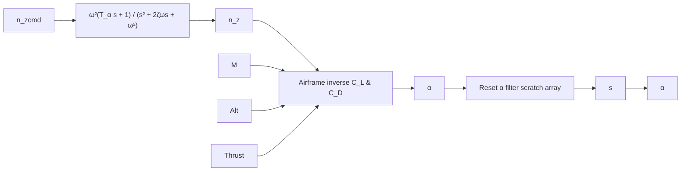

Fig. 3.18. Load factor command system.

This transfer function is expressed in the frequency domain and represents the lowerorder equivalent system of the full closed-loop system. We note that the load factor and angle-of-attack transfer functions are identical in form. Specifically, the dynamics for the load factor in the pitch plane, $n _ { z }$ , can be modeled by the following transfer function:

$$\frac {n _ {z} (s)}{n _ {\mathrm{zcmd}} (s)} = \frac {\omega^ {2} (T _ {\alpha} s + 1)}{s ^ {2} + 2 \zeta \omega s + \omega^ {2}}, \tag {3.59b}$$

where

$$n _ {z c} = \text { commanded load factor in the pitch plane },T _ {\alpha} = A O A \text { time constant (sec) },$$

and $\omega , \zeta$ , and s are defined as in (3.59a). The parameters $\omega , \zeta$ , and $T _ { \alpha }$ can be found by linear analysis of the entire closed-loop system. The above transfer function is valid, provided that the load factor being modeled is located at the center of pressure (cp), that is, the point ahead of the center of gravity (cg) where the effect of pitch acceleration and horizontal tail force cancel. Moreover, load factor measured at the center of pressure will reflect forces mostly due to angle of attack, which is why it has the same transfer function form. This assumption eliminates having to deal with a pair of complex second-order zeros in the numerator for an $n _ { z }$ accelerometer located away from the $c p$ . Figure 3.18 illustrates the load factor command system.
