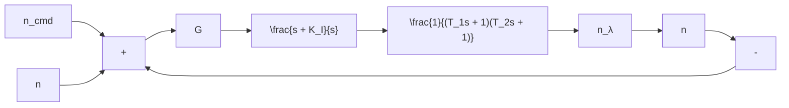

We have seen that in terms of the continuous system (3.55), a feedback network for the purposes of simulation that represents the load factor command system in both the pitch/yaw planes was shown in Figure 3.17. The load factor control system can be reduced to have an identical response to that of (3.55) with $y = n$ and $u = n _ { \mathrm { c m d } }$ . Specifically, this is done by properly computing the inner-loop parameters. This can be done by linearizing the airframe normal forces in the pitch and yaw planes to obtain the slopes $n _ { z \alpha }$ and $n _ { y \beta }$ . Since both the pitch and yaw use the same aerodynamic data, let $n _ { y \beta } = - n _ { z \alpha }$ or $n _ { z \alpha } = n _ { \lambda }$ , where λ is either α or $\beta$ (the sideslip angle). Then compute the slope at each frame. The linearization of the feedback network (see Figure 3.17), reduces to that shown in Figure 3.19.

flowchart

Fig. 3.19. Linearized load factor control system.

In Figure 3.19, $K _ { I }$ is an integrator gain and G is a gain whose function is to force the response of the reduced-order system to behave like the original system. Note that this system is identical to that of a digital aircraft yaw axis system.

Using the methods of classical feedback control theory, the inner-loop parameters are as follows:

$$\frac {1}{T _ {1}} = \frac {2 \zeta \omega + K _ {1}}{2} + \frac {1}{2} \sqrt {4 \zeta^ {2} \omega^ {2} - 4 \zeta \omega K _ {1} + K _ {1} ^ {2}}, \tag {3.60a}\frac {1}{T _ {2}} = \frac {2 \zeta \omega + K _ {1}}{2} - \frac {1}{2} \sqrt {4 \zeta^ {2} \omega^ {2} - 4 \zeta \omega K _ {1} + K _ {1} ^ {2}}, \tag {3.60b}G = \frac {\omega^ {2} T _ {1} T _ {2}}{n _ {\lambda}}, \tag {3.60c}K _ {1} = 2 \zeta \omega . \tag {3.60d}$$

Next, we need the expressions for $\zeta$ and $\omega .$ . In order to solve for these two parameters, we first write the second-order differential equation for the angle-of-attack response at launch with a forcing function of order 0. Thus,

$$\frac {d ^ {2} \alpha}{d t ^ {2}} + 2 \zeta \omega \left(\frac {d \alpha}{d t}\right) + \omega^ {2} \alpha = 0. \tag {3.61}$$
