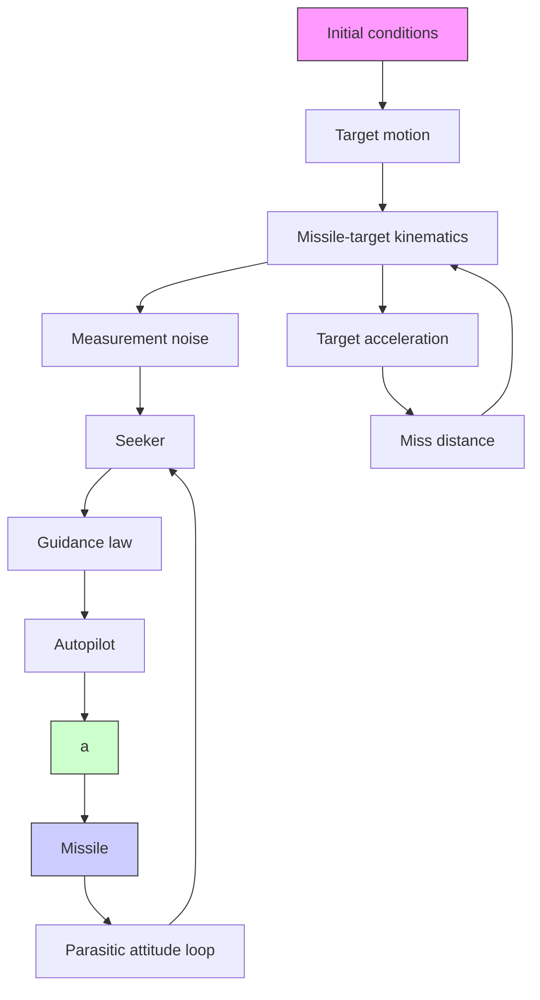

# 3.4 The Missile Guidance System Model

This section briefly describes the basic subsystems that form a missile’s guidance system. Guidance is the means by which a missile steers, or is steered, to a target. A guided missile is guided according to a certain guidance law. In this chapter we consider homing guidance systems. A meaningful comparison of homing guidance systems for missiles requires realistic models for the missile and its target engagement geometry model in order for terminal miss distance to be accurately evaluated. This model should include the important dynamics and system nonlinearities that influence performance, and yet be representative of missiles in general. In the simplest form, the principal elements that make up a missile guidance system are illustrated in Figure 3.22.

flowchart

Fig. 3.22. Major subsystems of a missile guidance system.

For a missile, the inputs are target location and missile-to-target separation. The desired output is that the missile have the same location as the target. The missile does this by using a certain guidance system and flying according to a certain guidance law. As stated in Chapter 1, the type of guidance system chosen is dependent on the overall weapon system in which the missile can be used, on the type of threat the missile will be used against, and the characteristics of the threat among other factors. The various subsystems indicated in Figure 3.22 will be discussed in the subsequent sections. It should be noted at the outset that the model developed herein assumes that the target and missile motions are constrained to a plane. Consequently, development of the missile and guidance models is limited to a single channel.

A more detailed block diagram for a controlled missile guidance model than the one illustrated in Figure 3.22, which includes the equations of motion and aerodynamics, is given in Figure 3.23. Note that this model is for a roll-stabilized missile.

Listed below are the three main problems that the guidance system designer must face in the design of a guidance system.
