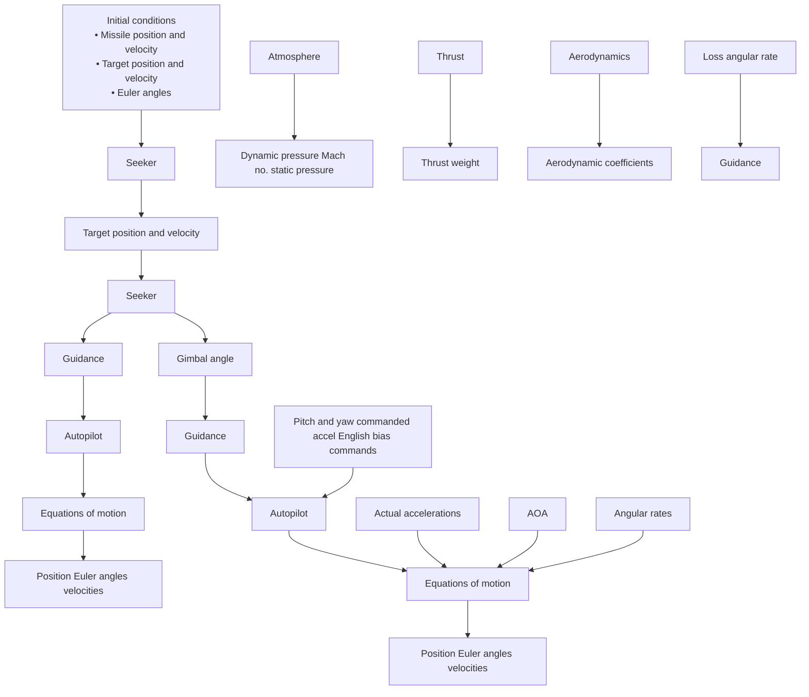

# General Problems of Guidance System Design

1. Help to maximize the single-shot kill probability (SSKP) by minimizing the miss distance.

flowchart

Fig. 3.23. A typical roll-stabilized missile guidance/kinematic loop.
