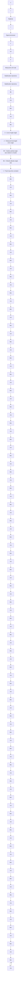

```mermaid
graph TD
    A["λ"] --> B["+"]
    B --> C["Radome"]
    C --> D["+"]
    D --> E["Signal processor"]
    E --> F["ε'"]
    F --> G["1/τ"]
    G --> H["λ'"]
    H --> I["Measured LOS rate"]
    I --> J["Stabilization dynamics"]
    J --> K["Stabilization dynamics"]
    K --> L["θ̇h"]
    L --> M["1/s"]
    M --> N["θm"]
    N --> O["1/s"]
    O --> P["θm"]
    P --> Q["λ = Line-of-sight angle"]
    Q --> R["ε' = Measured boresight error angle"]
    R --> S["θ̇h = Seeker gimbal angle rate relative to missile"]
    S --> T["θm = Missile attitude angle rate"]
    T --> U["τ = Track loop time constant"]
    U --> V["θ̇m"]
    V --> W["1/s"]
    W --> X["θm"]
    X --> Y["1/s"]
    Y --> Z["θm"]
    Z --> AA["1/s"]
    AA --> AB["θm"]
    AB --> AC["1/s"]
    AC --> AD["θm"]
    AD --> AE["1/s"]
    AE --> AF["θm"]
    AF --> AG["1/s"]
    AG --> AH["θm"]
    AH --> AI["1/s"]
    AI --> AJ["θm"]
    AJ --> AK["1/s"]
    AK --> AL["θm"]
    AL --> AM["1/s"]
    AM --> AN["θm"]
    AN --> AO["1/s"]
    AO --> AP["θm"]
    AP --> AQ["1/s"]
    AQ --> AR["θm"]
    AR --> AS["1/s"]
    AS --> AT["θm"]
    AT --> AU["1/s"]
    AU --> AV["θm"]
    AV --> AW["1/s"]
    AW --> AX["θm"]
    AX --> AY["1/s"]
    AY --> AZ["θm"]
    AZ --> BA["1/s"]
    BA --> BB["θm"]
    BB --> BC["1/s"]
    BC --> BD["θm"]
    BD --> BE["1/s"]
    BE --> BF["θm"]
    BF --> BG["1/s"]
    BG --> BH["θm"]
    BH --> BI["1/s"]
    BI --> BJ["θm"]
    BJ --> BK["1/s"]
    BK --> BL["θm"]
    BL --> BM["1/s"]
    BM --> BN["θm"]
    BN --> BO["1/s"]
    BO --> BP["θm"]
    BP --> BQ["1/s"]
    BQ --> BR["θm"]
    BR --> BS["1/s"]
    BS --> BT["θm"]
    BT --> BU["1/s"]
    BU --> BV["θm"]
    BV --> BW["1/s"]
    BW --> BX["θm"]
    BX --> BY["1/s"]
    BY --> BZ["θm"]
    BZ --> CA["1/s"]
    CA --> CB["θm"]
    CB --> CC["1/s"]
    CC --> CD["θm"]
    CD --> CE["1/s"]
    CE --> CF["θm"]
    CF --> CG["1/s"]
    CG --> CH["θm"]
    CH --> CI["1/s"]
    CI --> CJ["θm"]
    CJ --> CK["1/s"]
    CK --> CL["θm"]
    CL --> CM["1/s"]
    CM --> CN["θm"]
    CN --> CO["1/s"]
    CO --> CP["θm"]
    CP --> CQ["1/s"]
    CQ --> CR["θm"]
    CR --> CS["1/s"]
    CS --> CT["θm"]
    CT --> CU["1/s"]
    CU --> CV["θm"]
    CV --> CW["1/s"]
    CW --> CX["θm"]
    CX --> CY["1/s"]
    CY --> CZ["θm"]
    CZ --> DA["1/s"]
    DA --> DB["θm"]
    DB --> DC["1/s"]
    DC --> DD["θm"]
    DD --> DE["1/s"]
    DE --> DF["θm"]
    DF --> DG["1/s"]
    DG --> DH["θm"]
    DH --> DI["1/s"]
    DI --> DJ["θm"]
    DJ --> DK["1/s"]
    DK --> DL["θm"]
    DL --> DV["1/s"]
    DV --> DW["θm"]
    DW --> DX["1/s"]
    DX --> DW
```

Fig. 3.28. Typical block diagram of a seeker subsystem.

$$\varepsilon_ {m a x} ^ {\prime} = \tau \left(\frac {d \lambda}{d t}\right) _ {m a x}. \tag {3.82}$$
