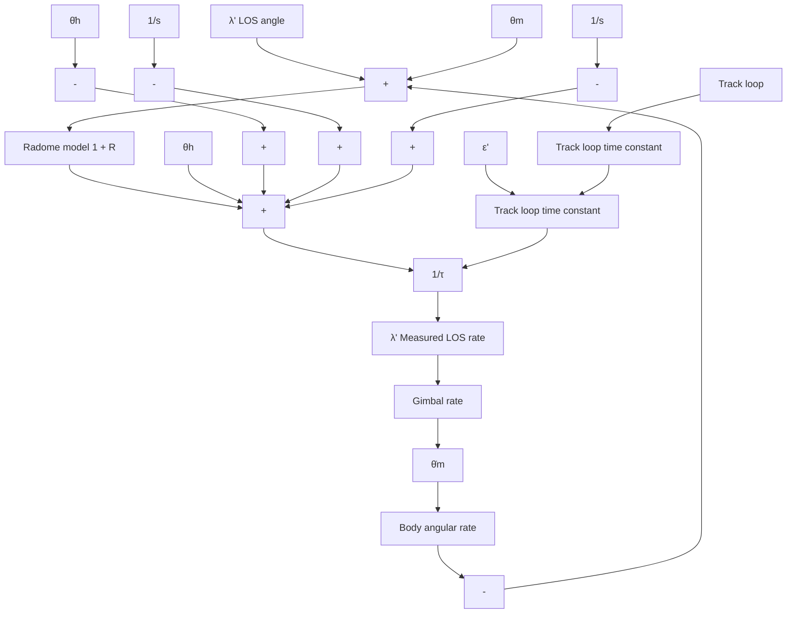

Assuming that τ is sufficiently small, $\varepsilon _ { m a x } ^ { \prime }$ can be held within the linear range of the received beamwidth. Figure 3.29 illustrates the resulting seeker block diagram with a linear refraction error model.

From Figure 3.29 it can be seen that the transfer function relating $\theta _ { m }$ to $\lambda ^ { \prime }$ is given by [3]

$$\lambda^ {\prime} / \theta_ {m} = - R / (1 + s \tau), \tag {3.83}$$

where $\lambda ^ { \prime }$ is the measured LOS angle. Thus, the measured LOS rate is corrupted by a term proportional to the body rate. Furthermore, since body rate is a result of commanded acceleration, a loop is formed that can have a destabilizing effect on missile attitude, resulting in an increase in miss distance. When R is zero, the contributions from the body angular rate input (see Figure 3.29) cancel, producing no effect on $\varepsilon ^ { \prime }$ . It is well known that most missiles use some form of proportional navigation as the guidance law. Although classical proportional navigation guidance uses measurements of LOS rate, it is more convenient to use measurements of LOS angle in guidance laws that utilize a Kalman filter. In such a case, let us define the measured LOS angle $\lambda ^ { \prime }$ as follows (see (3.78)):

$$\lambda^ {\prime} = (1 + R) \lambda - R \theta_ {m}. \tag {3.84}$$

flowchart

Fig. 3.29. Block diagram of the seeker model with track loop.

From Figure 3.29 it follows that

$$\varepsilon^ {\prime} = \tau s \lambda^ {\prime} / (1 + s \tau). \tag {3.85}$$

Now, since the boresight error is an observable quantity, (3.85) can be inverted, yielding

$$\lambda^ {\prime} = [ (1 + s \tau) / s \tau ] \varepsilon^ {\prime}. \tag {3.86}$$
