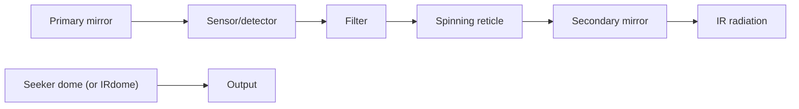

text_image

Rocket
motor
Blast
fragmentation
warhead
Guidance
and
control
IR
seeker

flowchart

Fig. 3.32. Example of a generic IR seeker and its location on a missile.

$$R _ {L O} = \left[ I / \left(L \xi_ {\min} \psi_ {n}\right) \right] ^ {1 / 2}, \tag {3.102}$$

where

I = target aircraft radiant intensity [w/steradian],

L = atmospheric loss or attenuation of the signature as it propagates over the distance $R _ { L O } \ ( R \geq 1 )$ ,

$$\xi_ {m i n} = \text { minimum SNR required by the IR sensor for target lock - on },\psi_ {n} = \text { noise equivalent flux density } [ w / m ^ {2} ].$$

As was the case with the radar SNR, the IR seeker also exhibits an SNR. For IR seekers, the SNR depends upon several effects: (1) the aspect of the target aircraft in the seeker field of view (FOV), (2) the distance from the aircraft to the seeker, (3) the off-boresight angle of the aircraft in the seeker FOV, and (4) the reflection of sunlight off the target body.
