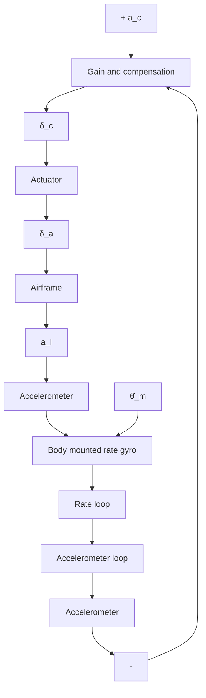

Note that it is standard practice in the design of missile autopilots to utilize a linearized second-order airframe model. The airframe acceleration command must be limited in an actual missile in order to prevent structural failure or an excessively large angle of attack, which causes increased missile drag and loss of lateral (note that in missiles, lateral movement usually means up–down or left–right) acceleration capability, often referred to as airframe acceleration saturation. Therefore, we can define the function of the autopilot subsystem as follows: (1) provide the required missile lateral acceleration response characteristics, (2) stabilize or damp the bare airframe, and (3) reduce the missile performance sensitivity to disturbance inputs over the missile’s flight envelope. Autopilots are commonly classified as either controlling the motion in the pitch/yaw planes, in which case they are called lateral autopilots, or controlling the motion about the fore-and-aft axis, in which case they are called roll autopilots (or longitudinal autopilots). Note that in aircraft design, the autopilot nomenclature is somewhat different from that of missile autopilots. Specifically, in aircraft nomenclature, autopilots designed to control the motion in the pitch plane are called longitudinal autopilots, while those designed to control motion in the yaw plane are called lateral autopilots.

flowchart

Fig. 3.33. Typical missile autopilot configuration.

Strictly speaking, a typical interceptor missile has three separate autopilots for control of roll, pitch, and yaw. The pitch and yaw autopilots control the lateral acceleration of the missile in accordance with some guidance law, such as the proportional navigation guidance law. Although the roll autopilot is not used directly in homing, nevertheless it is designed to enable maximum homing performance in the other two axes.
