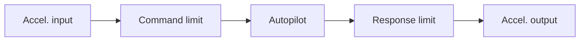

Fig. 3.34. Control system/aerodynamic response transfer function.

Another effect of importance to a real missile arises if the missile is rolling and the pitch/yaw autopilots fail to compensate for the roll. This effect, which manifests itself as roll cross-coupling, causes the lateral acceleration calculated in one plane to be executed, due to system lags, in another plane. For this reason, missiles are often fitted with roll-attitude hold autopilots. The autopilot also assumes that the missile roll rate is either zero, or known and compensated for. Indicated in Figure 3.34 is the flow of commanded and output normal accelerations through the missile control system.

In Figure 3.34, $\omega _ { n }$ is the system natural frequency, ζ is the system-damping ratio, and s is the Laplace operator. Before passing into the autopilot, the commanded accelerations are checked to ensure that they do not exceed structural or aerodynamic limits. That is, the inputs to the autopilot block transfer function are restricted to some maximum value if limits are exceeded. The autopilot block transfer function can be represented either as a first- or second-order lag with inputs of commanded acceleration and outputs of realized output acceleration. The roll, pitch, and yaw autopilots will now be discussed in more detail.
