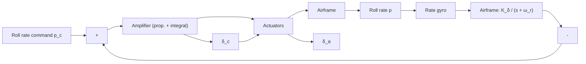

Fig. 3.35. Block diagram of a roll autopilot.

One common type of roll autopilot utilizes a spring-restrained rate gyroscope for measurement of roll rate, in conjunction with proportional-plus-integral (PI) compensation in the autopilot amplifier, in order to give the approximate equivalent of roll-rate plus roll-angle feedback. Other roll autopilot designs utilize a free vertical gyroscope as an attitude reference. That is, in order to maintain a desired roll angle, an attitude reference must be used. A block diagram of the roll autopilot is shown in Figure 3.35.

A more elaborate missile design has utilized a full-fledged stable platform, however, for other reasons as well as roll control. The function of the amplifier in the roll autopilot is to send aileron-command signals to either two diametrically opposite fin (or wing) servos or to all four. The airframe transfer function can be represented simply by

$$p / \delta_ {a} = K _ {\delta} / (s + \omega_ {c r}),$$

where p is the roll rate, $\delta _ { a }$ is the commanded aileron deflection, $K _ { \delta }$ is the surface effectiveness, s is the Laplace operator, and $\omega _ { c r }$ is the maximum gain-crossover frequency. As indicated in Figure 3.35, roll stabilization is obtained by sensing the roll rate with a rate gyroscope. The gyro output is amplified and applied to a phasesensitive comparator. This output is then electronically integrated, and the resulting signal is used, as stated above, to deflect fins 2 and 4 differentially (the fin order and nomenclature will be discussed in Section 3.5.1). In other words, the required rolling moment can be achieved by differential movement of the control surfaces. The variation in stabilization-loop bandwidth is a function of aerodynamic pressure, which is dependent upon missile altitude and velocity. Electronic gain in the loop also is a factor affecting bandwidth. Some missiles use altitude band-switching.
