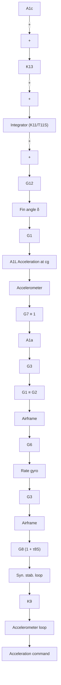

Variation of dynamic pressure with flight conditions also alters the pitch/yaw autopilot characteristics, as in the roll autopilot, from the one extreme of fast response with minimum stability at high dynamic pressures to the other extreme of relatively slow response with maximum stability at low dynamic pressures. This effect can be minimized by providing altitude gain switching, which permits a prelaunch selection of the proper launch logic as a function of launch altitude and target altitude. This launch logic is used to determine the proper in-flight switching, which occurs as the missile goes from midcourse to terminal phase. In addition, an in-flight course correction command called English bias (for a discussion of English bias, see Section 3.6) is processed by the pitch/yaw autopilot to correct for a missile launch at other than the desired lead angle. Because missile acceleration and slowdown during the boost and glide phases of flight affect the missile lead angle for proper intercept, axial compensation provides lateral commands to the pitch/yaw autopilot in order to adjust the lead angle. From the time the flight control pressure (e.g., hydraulic) is up, pitch or yaw stabilization is obtained by sensing pitch or yaw rates with the pitch or yaw rate gyros, respectively. A block diagram mechanization of a conventional pitch/yaw autopilot is shown in Figure 3.36.

flowchart

Fig. 3.36. The pitch/yaw autopilot.
