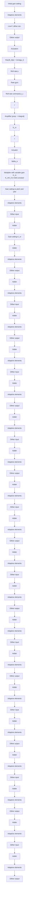

```mermaid
graph TD
    A["Initial gain setting"] --> B["Adaptive elements"]
    B --> C["Low-F. dither osc."]
    C --> D["Dither output"]
    D --> E["Actuators"]
    E --> F["\frac{K_δ}{s + \omega_r}"]
    F --> G["Roll rate p"]
    G --> H["Rate gyro"]
    H --> I["Roll-rate command p_c"]
    I --> J["+"]
    J --> K["Amplifier (prop. + integral)"]
    K --> L["K_m"]
    L --> M["+"]
    M --> N["Actuator"]
    N --> O["\delta_a"]
    O --> P["Multiplier with variable gain K_m\nK_mK_δ is held constant"]
    P --> Q["Gain setting to pitch and yaw"]
    Q --> R["Adaptive elements"]
    R --> S["Dither input"]
    S --> T["Adder"]
    T --> U["Gain setting K_m"]
    U --> V["Adder"]
    V --> W["Adaptive elements"]
    W --> X["Dither output"]
    X --> Y["Adder"]
    Y --> Z["Adaptive elements"]
    Z --> AA["Dither input"]
    AA --> AB["Adder"]
    AB --> AC["Adaptive elements"]
    AC --> AD["Dither output"]
    AD --> AE["Adder"]
    AE --> AF["Adaptive elements"]
    AF --> AG["Dither input"]
    AG --> AH["Adder"]
    AH --> AI["Adaptive elements"]
    AI --> AJ["Dither output"]
    AJ --> AK["Adder"]
    AK --> AL["Adaptive elements"]
    AL --> AM["Dither input"]
    AM --> AN["Adder"]
    AN --> AO["Adaptive elements"]
    AO --> AP["Dither output"]
    AP --> AQ["Adder"]
    AQ --> AR["Adaptive elements"]
    AR --> AS["Dither input"]
    AS --> AT["Adder"]
    AT --> AU["Adaptive elements"]
    AU --> AV["Dither output"]
    AV --> AW["Adder"]
    AW --> AX["Adaptive elements"]
    AX --> AY["Dither input"]
    AY --> AZ["Adder"]
    AZ --> BA["Adaptive elements"]
    BA --> BB["Dither output"]
    BB --> BC["Adder"]
    BC --> BD["Adaptive elements"]
    BD --> BE["Dither input"]
    BE --> BF["Adder"]
    BF --> BG["Adaptive elements"]
    BG --> BH["Dither output"]
    BH --> BI["Adder"]
    BI --> BJ["Adaptive elements"]
    BJ --> BK["Dither input"]
    BK --> BL["Adder"]
    BL --> BM["Adaptive elements"]
    BM --> BN["Dither output"]
    BN --> BO["Adder"]
    BO --> BP["Adaptive elements"]
    BP --> BQ["Dither input"]
    BQ --> BR["Adder"]
    BR --> BS["Adaptive elements"]
    BS --> BT["Dither output"]
    BT --> BU["Adder"]
    BU --> BV["Adaptive elements"]
    BV --> BW["Dither input"]
    BW --> BX["Adder"]
    BX --> BY["Adaptive elements"]
    BY --> BZ["Dither output"]
```

Fig. 3.38. Typical self-adaptive roll autopilot.
