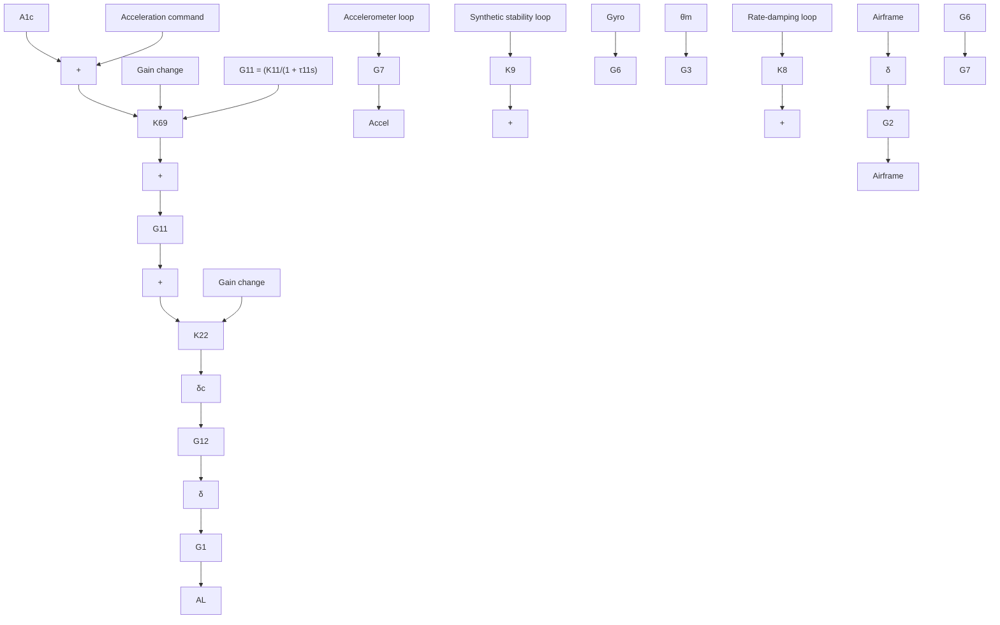

```mermaid
graph TD
    A["A1c"] --> B["+"]
    B --> C["K69"]
    C --> D["+"]
    D --> E["G11"]
    E --> F["+"]
    F --> G["K22"]
    G --> H["δc"]
    H --> I["G12"]
    I --> J["δ"]
    J --> K["G1"]
    K --> L["AL"]
    M["Gain change"] --> C
    N["Gain change"] --> G
    O["Acceleration command"] --> B
    P["Accelerometer loop"] --> Q["G7"]
    Q --> R["Accel"]
    S["Synthetic stability loop"] --> T["K9"]
    T --> U["+"]
    V["Rate-damping loop"] --> W["K8"]
    W --> X["+"]
    Y["Gyro"] --> Z["G6"]
    AA["θ̇m"] --> AB["G3"]
    AC["Airframe"] --> AD["δ"]
    AD --> AE["G2"]
    AE --> AF["Airframe"]
    AG["G11 = (K11/(1 + τ11s)"] --> C
    AH["G6"] --> AI["G7"]
```

Fig. 3.39. Pitch/yaw autopilot for self-adaptation.
