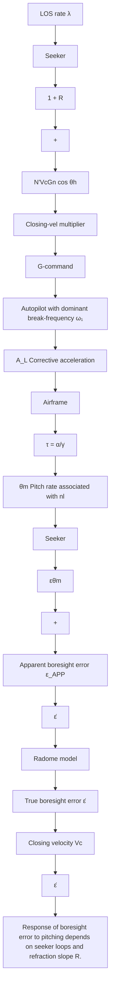

Figure 3.40 depicts the guidance subsystem as having an input LOS rate $d \lambda / d t$ , an output corrective acceleration $A _ { L }$ , and a parasitic attitude loop. The direct path from $d \lambda / d t$ to $A _ { L }$ shows the mechanization of the proportional navigation law (indicated by the “closing velocity multiplier” block), with a low-pass noise filter in order to reduce the high-frequency noise, chiefly for the sake of the fin servos inside the autopilot. If only this direct path from $d \lambda / d t$ to $A _ { L }$ existed, then the guidance design would be much easier than it actually is. In the feedback path of Figure 3.40, the airframe transfer function relates the pitch rate to the lateral acceleration of the $c g$ .

flowchart

Fig. 3.40. The parasitic attitude loop (inside guidance kinematic loop).

The alpha over gamma dot time constant τ may be a fraction of a second at low altitude and may exceed 10 seconds at high altitude. Neglecting the feedback for a moment, it is seen that the LOS rate $d \lambda / d t$ causes the seeker to develop a boresight error signal that is multiplied by the closing velocity $V _ { c }$ and suitably filtered to form a g-command $A _ { l c }$ for the autopilot. The feedback arises because the missile must develop a pitch rate $d \theta _ { m } / d t$ , and this disturbs the gyro-stabilized seeker (if such is used) a finite amount, thus changing the boresight error $\varepsilon _ { a p p }$ . Also, during pitching motion the seeker must look through a different part of the radome with a different refraction, and this too affects the boresight error signal.
