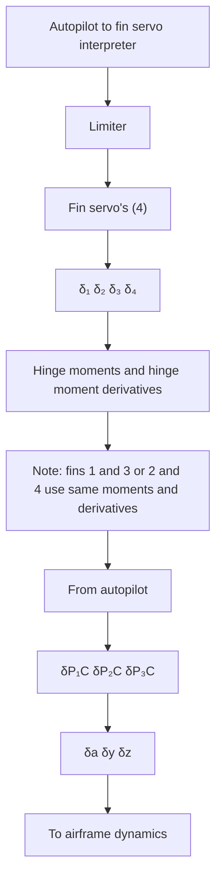

In essence, the actuator consists of the control surfaces (or fins) and associated servomechanisms, and is used to change the missile’s attitude and trajectory or flight path. Therefore, the function of the four fin actuators is to move the control surfaces in accordance with commands from the three autopilots. The autopilot outputs are virtual fin deflection commands shown in Figure 3.41b. In Figure 3.41b, the roll autopilot is along the $P _ { 1 }$ axis, while the pitch and yaw axes are along the $P _ { 3 }$ and $P _ { 2 }$ axes, respectively; the corresponding positive fin deflection commands are indicated by the corresponding $\delta \boldsymbol { P } ^ { * } \boldsymbol { \mathbf { s } }$ . The four real fins are located in the missile or M-frame, which is shown in Figure 3.41a and is rotated from the autopilot axis system (P ) by an angle $\phi _ { P }$ . In order to obtain equivalent effects, the autopilot commands must be transformed through $- \phi _ { P }$ . The roll command is affected by a differential deflection, and the sign is such that a positive roll command is accomplished by negative deflection of fins 1 and 2 and a positive deflection of fins 3 and 4. Note that this is not the only fin convention and/or arrangement available to the missile designer. Reference [3] gives a somewhat different fin convention. In some applications it is preferable to put the autopilot axes in the plane of the control surfaces, and so only two surfaces are deflected by the pitch autopilot and two are deflected by the yaw autopilot. The resulting fin deflections from the actuator models are recombined into equivalent deflections used in the computation of airframe forces and moments. Thus,

flowchart

Fig. 3.42. Autopilot to fin servo to airframe dynamics flow.
