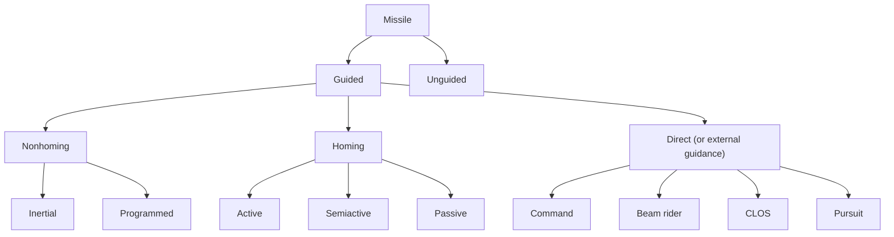

Another way to classify homing systems is by the frequency spectrum to which the system is sensitive (i.e., the wavelength it seeks out). Moving through the spectrum from low to high frequency, sound has had some use in seeker systems. Naval torpedoes have been developed as passive sound seekers, but such seekers have certain drawbacks. The sound-seeking missile is limited in range and utility because it must be shielded or built so that its own motor noises and sound from the launching platform will not affect the seeker head. Electromagnetic radiation is the most popular form of energy detected by homing systems. Radar can be the primary sensor for any of the three classes of homing guidance systems, but it is best suited for semiactive and active homing. Currently, the use of electromagnetic radiation via radar in a target seeker is foremost in effectiveness. Radar is little restricted by weather or visibility, but is susceptible to enemy jamming. Heat (infrared radiation) is best used with a passive seeker. It is difficult to mislead or decoy heat-seeking systems when they are used against aerial targets because the heat emitted by engines and rockets of the aerial targets is difficult to shield. With a sufficiently sensitive detector, the infrared system is very effective. Light is also useful in a passive seeker system. However, both weather and visibility restrict its use. Such a system is quite susceptible to countermeasure techniques.

flowchart

Fig. 4.1. Missile types and classification.
