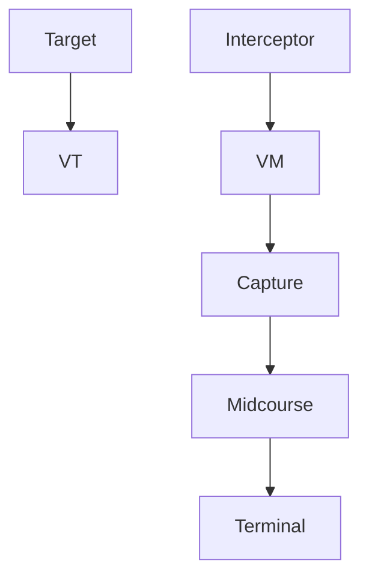

text_image

Ng = const

(g) Constant load factor:

text_image

λ
λ = 0

(h) Proportional navigation:

natural_image

Silhouette diagram of aircraft trajectories with arrows indicating movement, no text or symbols present

(i) Three-point:   
Fig. 4.3. continued

2. Probability of Detection: For a given target at a given range, what is the probability that the target will be detected?   
3. Single-Shot Kill Probability: Given an operable missile launched against a known target, what is the probability that it will destroy the target?

The overall weapon system effectiveness, or probability of kill, is the product of these probabilities. Note that unless otherwise specified, it will be assumed that the interceptor missile uses radar as its onboard sensing/tracking system.

The guidance systems discussed in this section are summarized in Table 4.2. Listed with each type of guidance system are the possible methods of navigation, the sensing devices that may be used to locate and/or track the target, and some important characteristics that make each type suitable for certain situations.

flowchart

Fig. 4.4. General pursuit guidance course.
