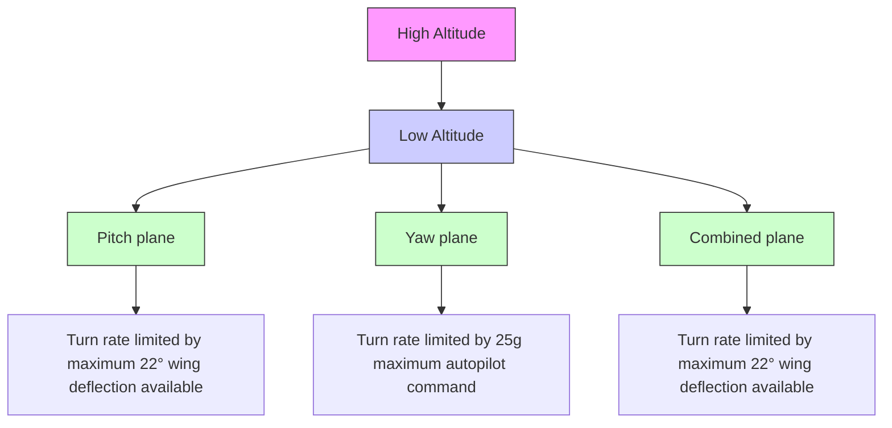

# Description

Pure pursuit strives to keep the vehicle’s (i.e., missile’s) heading always pointing to the target, in order to achieve the maximum killing capability:

flowchart

(a) Maximum maneuver capability.

text_image

Y
Y'
Target
Vt
γt
r
λ
|λ - θ| ≤ 45°
vm
α
γm
u
θ
X'
X
w
Missile
0

(b) Geometry of the interception process.   
Fig. 4.10. Target interception maneuver capability and geometry.
