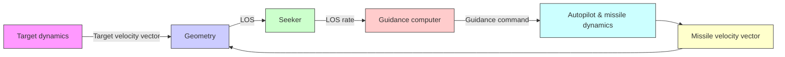
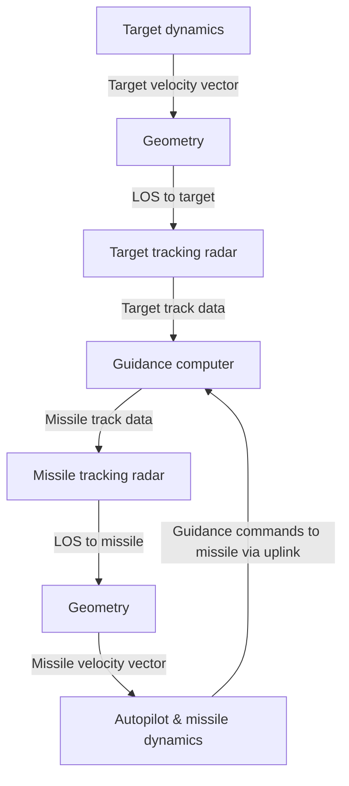

(a) Block diagram for proportional navigation

```mermaid
graph LR
    A["y_t"] --> B["+"]
    B --> C["y_e"]
    C --> D["1/(v_c t_go)"]
    D --> E["λ"]
    E --> F["s"]
    F --> G["λ̇"]
    G --> H["N' V_c / cos θ_h"]
    H --> I["a_{lc}"]
    I --> J["Autopilot"]
    J --> K["a_l"]
    K --> L["cos θ_h"]
    L --> M["..."]
    M --> N["∫_o^t ( ) dt"]
    N --> O["+"]
    O --> P["∫_o^t ( ) dt"]
    P --> Q["..."]
    Q --> R["..."]
    R --> S["ŷ_m(t=0)"]
    S --> T["..."]
    T --> U["Guidance system"]
    U --> V["Closing velocity multiplier"]
    V --> W["..."]
    W --> X["..."]
    X --> Y["..."]
    Y --> Z["..."]
    Z --> A
```

flowchart

(b) Guidance kinematics loop   
Fig. 4.15. Schematic of a typical guidance system.

When the speedgate (to be discussed later in this section) is locked and starts tracking the Doppler video signal, a command is generated and fed to the autopilot, which switches the English bias command out of the acceleration command processor and switches in axial compensation if this has not already been accomplished by the launch plus 3 sec command. At speedgate lock, radar error commands, which have been amplified and adjusted by closing velocity in the error multiplier, command the pitch or yaw autopilot to process lateral ${ g } ^ { \prime } { \bf { s } } \left( { a } _ { n c } \right)$ . These lateral (or normal) $g ^ { \ast } \mathrm { \mathbf { s } }$ are integrated with an integrator that has been set to the proper altitude band gain. The output of this integrator is a wing command in degrees/sec, which is applied to the appropriate wing hydraulic servo system. As the missile responds to these g commands, the appropriate accelerometer senses these lateral $g ^ { \prime } \mathbf { s }$ and hence generates a signal, which is amplified and synchronously detected for direction by a comparator and is then summed with the original g command to close the accelerometer loop.

flowchart

Fig. 4.16. System block diagram for command guidance.
