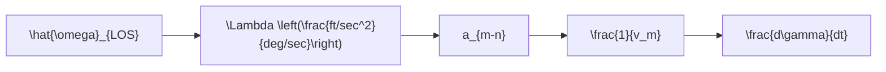

where it is assumed that the missile has constant speed $( \mathrm { i } . \mathrm { e } . , d v _ { m } / d t = 0 )$ . If the angle of attack α is equal to 0, then the missile acceleration normal to the longitudinal axis $a _ { m n }$ is given by the expression

$$a _ {m n} = v _ {m} \left(\frac {d \gamma}{d t}\right). \tag {4.62}$$

From (4.60),

$$a _ {m n} = v _ {m} \left(\frac {d \gamma}{d t}\right) \cos (\gamma - \lambda). \tag {4.63}$$

Now, from Figure 4.18(a) we obtain the following relationship:

$$\mathbf {R} _ {M T} = R _ {M T} \mathbf {1} _ {L O S}, \tag {4.64}$$

where

$$R _ {M T} = | \mathbf {R} _ {M T} | = \text { missile - target distance },\mathbf {1} _ {L O S} = \text { unit vector along the } L O S.$$

Taking the derivative of (4.64) yields

$$\frac {d \mathbf {R} _ {M T}}{d t} = \left(\frac {d R _ {M T}}{d t}\right) \mathbf {1} _ {L O S} + R _ {M T} \left(\frac {d \mathbf {1} _ {L O S}}{d t}\right) = \left(\frac {d R _ {M T}}{d t}\right) \mathbf {1} _ {L O S} + R _ {M T} \left(\frac {d \lambda}{d t}\right) \mathbf {1} _ {n}, \tag {4.65}$$

where ${ \bf 1 } _ { n }$ is a unit vector normal to ${ \bf R } _ { M T }$ and $d { \bf R } _ { M T } / d t$ is the range rate. After taking the second derivative of (4.65), we have the following relations:

$$\mathbf {R} _ {M T} = \mathbf {R} _ {O T} - \mathbf {R} _ {O M},\mathbf {a} _ {M T} = \mathbf {a} _ {O T} - \mathbf {a} _ {O M},$$

where $\mathbf { a } _ { O T }$ and a $o M$ are the target and missile accelerations relative to the inertial frame $( x , y )$ . Now $\mathbf { a } _ { O T }$ and $\mathbf { a } _ { O M }$ can be resolved into components along $\mathbf { 1 } _ { L O S }$ and ${ \bf 1 } _ { n }$ , resulting in

$$a _ {T - L O S} - a _ {M - L O S} = \frac {d ^ {2} R _ {M T}}{d t ^ {2}} - R _ {M T} \left(\frac {d \lambda}{d t}\right) ^ {2}, \tag {4.66a}a _ {T - n} - a _ {M - n} = 2 \left(\frac {d R _ {M T}}{d t}\right) - \left(\frac {d \lambda}{d t}\right), \tag {4.66b}$$

flowchart

Fig. 4.19. Generation of missile turning rate.

where $a _ { T - L O S }$ and $a _ { M - L O S }$ are the target and missile accelerations along the LOS, and $a T { - } n$ and $a _ { M - n }$ are the accelerations normal to the LOS. From (4.66b) we obtain
