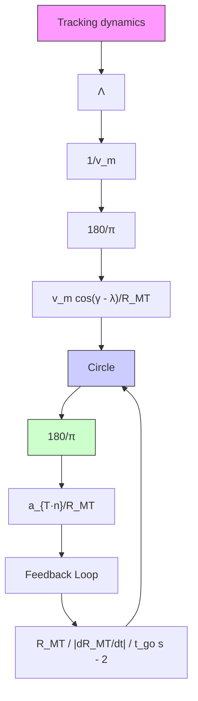

$$\frac {d \omega_ {L O S}}{d t} = \left[ - 2 \left(\frac {d R _ {M T}}{d t}\right) \omega_ {L O S} \right] / R _ {M T} + (a _ {T - n} - a _ {M - n}) / R _ {M T}, \tag {4.67}$$

where $\omega _ { L O S } = d \lambda / d t$ . Finally, from (4.60) we can write $( d \omega _ { L O S } / d t )$ in the form

$$\frac {d \omega_ {L O S}}{d t} = - \left[ 2 \left(\frac {d R _ {M T}}{d t}\right) / R _ {M T} \right] \omega_ {L O S} + \left(a _ {T - n} / R _ {M T}\right) \tag {4.68a}- \left[ \left(\frac {d \gamma}{d t}\right) v _ {M} \cos (\gamma - \lambda) \right] / R _ {M T},$$

or

$$\frac {d \omega_ {L O S}}{d t} = - \left[ 2 \left(\frac {d R _ {M T}}{d t}\right) / R _ {M T} \right] \omega_ {L O S} + \left(a _ {T - n} / R _ {M T}\right) (1 8 0 / \pi) \tag {4.68b}- \left[ \left(\frac {d \gamma}{d t}\right) v _ {M} \cos (\gamma - \lambda) \right] / R _ {M T}$$

and

$$\frac {d \gamma}{d t} = (\Lambda / v _ {M}) (1 8 0 / \pi) \hat {\omega} _ {L O S}, \tag {4.68c}$$

where

$$\hat {\omega} _ {L O S} = \text { estimate of the } L O S [ \deg / \sec ],\Lambda = a _ {M - n} / \hat {\omega} _ {L O S} [ (\mathrm{ft/sec} ^ {2}) / \mathrm{deg/sec} ],v _ {M} = \text { missile velocity } [ \mathrm{ft/sec} ].$$

As we discussed earlier, in proportional navigation the missile turning rate $( d \gamma / d t )$ is made proportional to the best estimate of the LOS rate available. That is, proportional navigation implies that for a no-time-lag missile,

$$\frac {d \gamma}{d t} = \xi \hat {\omega} _ {L O S}, \tag {4.69}$$

where $\xi = \Lambda / v _ { M }$ . The blocks representing (4.69) are shown in Figure 4.19.

Finally, we note that the missile effective navigation ratio $N ^ { \prime }$ is given by the relation

$$N ^ {\prime} = \left\{[ K _ {T} \Lambda \cos (\gamma - \lambda) ] / \left| \frac {d R _ {M T}}{d t} \right| \right\} (1 8 0 / \pi), \tag {4.70}$$

flowchart

Fig. 4.20. Closed-loop configuration for the angle tracker.
