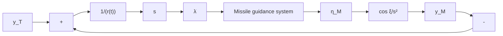

Y
a_n
(V_M, Y_M)
γ
λ
Missile
R
Intercept
(X_T, Y_T)
Target
X
Inertial coordinate system
</details>

Fig. 4.23. Missile–target intercept geometry.

Rate of Change of Missile Heading or Body Angle $( d \gamma _ { m } / d t )$

$$\frac {d \gamma_ {m}}{d t} = N \left(\frac {d \lambda}{d t}\right). \tag {4.26}$$

Guidance Law

$$\frac {d \gamma}{d t} = [ N / (1 + \tau s) ] \left(\frac {d \lambda}{d t}\right) = \left(\frac {d ^ {2} y _ {m}}{d t ^ {2}}\right) (1 / v _ {m} \cos \gamma),$$

where γ is the body angle, τ is the time constant, and s is the Laplace operator.

Line of Sight (LOS), λ

$$\lambda = (y _ {t} - y _ {m}) / R.$$

Time-to-Go, $t _ { g o }$

$$t _ {g o} = T - t = R / v _ {c} = (R _ {t} - R _ {m}) / \left[ \left(\frac {d R _ {m}}{d t}\right) - \left(\frac {d R _ {m}}{d t}\right) \right]. \tag {4.56}$$

Missile-Target Geometry Loop (see Figure 4.24)


<details>
<summary>flowchart</summary>


</details>

Fig. 4.24. ξ = lead angle (i.e., angle between missile velocity vector and the LOS)

Typical missile–target geometry loop.

Generation of Target Displacement from White Noise (see Figure 4.25)


<details>
<summary>flowchart</summary>

```mermaid
graph LR
    A["u(t)"] --> B["2β√v"]
    B --> C["+"]
    C --> D["1/s"]
    D --> E["aT(t)"]
    E --> F["1/s"]
    F --> G["vT(t)"]
    G --> H["1/s"]
    H --> I["yT(t)"]
    I --> J["x1(t)"]
    J --> K["x2(t)"]
    K --> L["x3(t)"]
    L --> M["2v"]
    M --> N["-"]
    N --> C
    style A fill:#fff,stroke:#000
    style J fill:#fff,stroke:#000
    style K fill:#fff,stroke:#000
    style L fill:#fff,stroke:#000
    style M fill:#fff,stroke:#000
    style N fill:#fff,stroke:#000
    note right of M H(s) = (2β√v)/(s + 2v)
```
</details>

Fig. 4.25. Diagram for the generation of target displacement from white noise.
