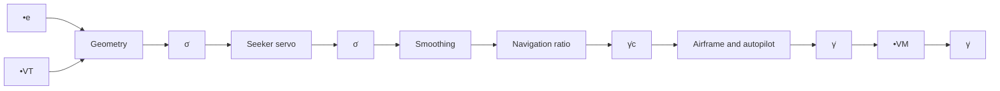

# An Example.

This example summarizes the concept of proportional navigation guidance and how it relates to the work presented thus far in this book. In particular, the example will deal with a semiactive homing missile. Although some of the equations are a repetition of the equations already derived in this section, nevertheless, a set of new equations will be developed that may be used as the basis for further research by the interested reader. Consider the geometry of the interception problem for a homing missile as shown in Figure 4.26.

From this figure, the equations of motion can be written as follows (see also (4.25a,b)):

$$\frac {d R _ {M T}}{d t} = - V _ {M} \cos (\gamma - \sigma) - V _ {T} \cos (\sigma - \gamma_ {T}), \tag {1}R _ {M T} \left(\frac {d \sigma}{d t}\right) = - V _ {M} \sin (\gamma - \sigma) + V _ {T} \sin (\sigma - \gamma_ {T}), \tag {2}$$

where

RMT = distance from missile to target,

$V _ { M }$ = missile velocity,

$V _ { T }$ = target velocity,

γ = missile velocity vector angle with respect to space coordinates,

$\gamma _ { T }$ = target velocity vector angle with respect to space coordinates,

σ = angle of missile-to-target sight line with respect to space coordinates.

text_image

y
Reference axis
γT
Target
VT
Target velocity
Body axis
VM
LOS
e
Seeker axis
σ'
θ
σ
γ
Missile
x
Reference axis
δ
Control surface

Fig. 4.26. Geometrical relationship between a homing missile and its target.

flowchart

Fig. 4.27. Homing action feedback loop.

As before, differentiation of (2) with no restraints gives
