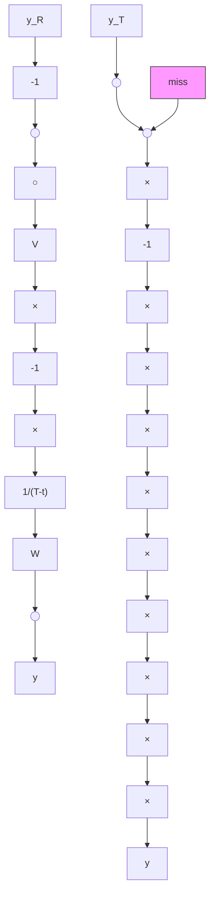

flowchart

Fig. 4.29. Block diagram for APN.

where $a _ { M }$ is the interceptor missile acceleration, $a _ { T }$ is the target acceleration, and the APN infinite bandwidth is given by

$$V (s) = 1. 0,W (s) = N ^ {\prime} / s. \tag {4.81}$$

In this case, the interceptor maneuver is equal to the target maneuver for all values $N ^ { \prime } ( a _ { M } / a _ { T } = 1 . 0 )$ . The block diagram corresponding to APN is shown in Figure 4.29. In practice, the second derivative of $y _ { T }$ would be estimated and added directly as an acceleration command to the missile guidance system.

The solution given for (4.78) corresponds to the case where the augmentation command $y _ { T }$ has either the same error as the PN term or an entirely independent error. That is, $y _ { R }$ is the error on the sensed $y _ { T }$ in the augmentation, and $y _ { N }$ the error on $y _ { T } - y$ in the PN portion of the system. Noise impulse responses for the common sensor mechanization are denoted by $y _ { N R }$ , and for two sensors by $y _ { N }$ and $y _ { R }$ .

The key feature of the guidance law pursued herein (APN) is the reduced $g$ requirement relative to PN, associated with a given level of miss effectiveness against target maneuver. Thus, the interceptor $g$ requirements to satisfy the guidance law are solved for the case of infinite bandwidth, that is, with guidance time lags neglected. The infinite bandwidth acceleration solutions for PN and APN are plotted for several cases in Figure 4.30.
