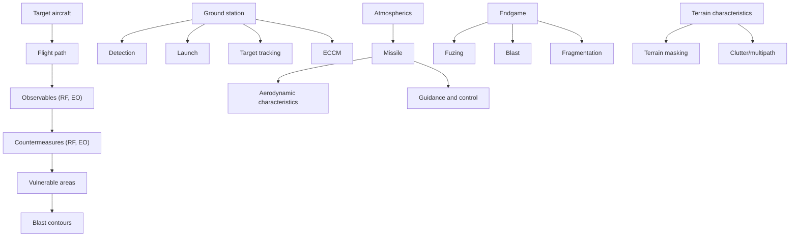

Fig. 4.36. Interaction between an airborne target and a SAM air defense system.

where

$$
\rho (x, y) = \text { the miss distance }
\begin{array}{l} V (x, y) = \text { kill   function   that   defines   the   probability   that } \\ \quad \text { the   target   is   killed   due   to   a   propagator   (i.e.,   missile) } \\ \quad \text { whose   trajectory   intersects   the   intercept   plane } \\ \quad \text { at   } x, y, \end{array}
P _ {f} (x, y) = \text { probability of fuzing }.
$$

In typical tactical homing missile cases, the single-shot kill probability is not a function of range, because as long as all parts of the radar missile system are operating within their designed dynamic range, the distance from the missile launch site to the target is unimportant. In the command guidance or gunfire situation this is not the case, so that the single-shot probability is a function of target range, and the cumulative $P _ { k }$ equations must be modified accordingly. In the actual case, $P _ { k c u m }$ can be only approximated by the above mathematics because the shots of a salvo are not mutually independent. Each shot uses the same radar information, computer, launcher, etc. Also, the first missile may not kill the target but only damage it and therefore would not be classified as a success. However, the killing job for the succeeding missiles is made easier. The $P _ { k }$ of a radar missile system is dependent on many factors in the chain of events that occur from target detection to interception.
