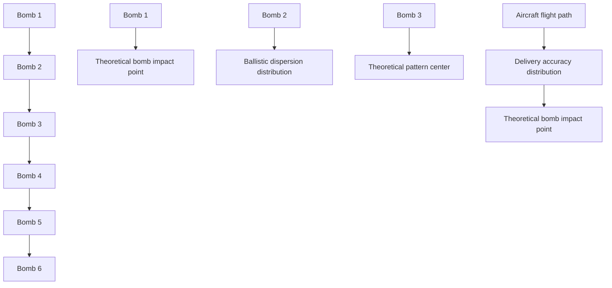

# 5.2 Definitions and Acronyms Used in Weapon Delivery

Before we discuss the problem of weapon delivery, it is appropriate to define at this point some of the most common terms and acronyms that the reader will encounter in dealing with the concept of weapon delivery.

flowchart

Fig. 5.1. Ballistic dispersion.
