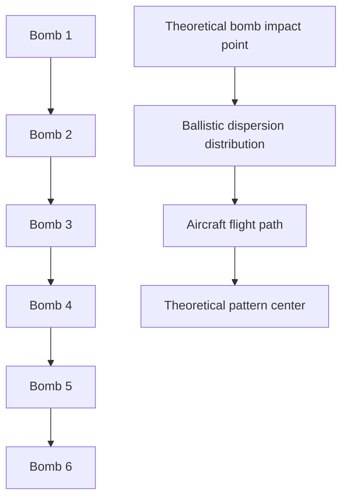

Fig. 5.4. Sample DEP.

flowchart

Fig. 5.5. Delivery accuracy.

Note that Figure 5.5 is similar to Figure 5.1; also, note that in Figure 5.5 the delivery accuracy distribution is centered.

Desired Mean Point of Impact (DMPI): DMPI is the planned, or intended, aimpoint used by the pilot during a weapon delivery.

Dive Toss: A weapon-delivery maneuver in which the aircraft is dived to a predetermined altitude point in space, pulled up, and the weapon released in such a way that it is tossed onto the target.

Doppler/Doppler Effect: A frequency shift due to velocity on a reflected signal. Used for velocity measurement and moving-target detection/tracking.

Firing/Launch Envelope: A locus of points that represent the position of an aircraft target when a missile or other projectile can be fired/launched with the expectation of achieving an intercept on the aircraft. When considering ground-based (or seabased) threats, the launch envelope is generally depicted relative to the location of the threat. Conversely, the launch envelope is normally shown relative to the target aircraft in the consideration of airborne threats. This envelope considers the tracking time required before a launch can feasibly be accomplished.

Gravity Drop: A measure of the deviation in the flight path of a projectile attributable to gravitational force. Gravity drop is used to describe the displacement in the ideal trajectory of a projectile due to gravity. The gravity drop is proportional to the time of flight and has been approximated as $\scriptstyle { \frac { 1 } { 2 } } g t ^ { 2 }$ , where g is the gravitational force and t is the time of flight (MIL-STD-2089).

Ground Plane: The plane that the target rests upon, which is parallel to level ground.

Hit Distribution: A mathematical representation that defines the results of a firing pass on an aircraft in terms of the probability of n hits.
