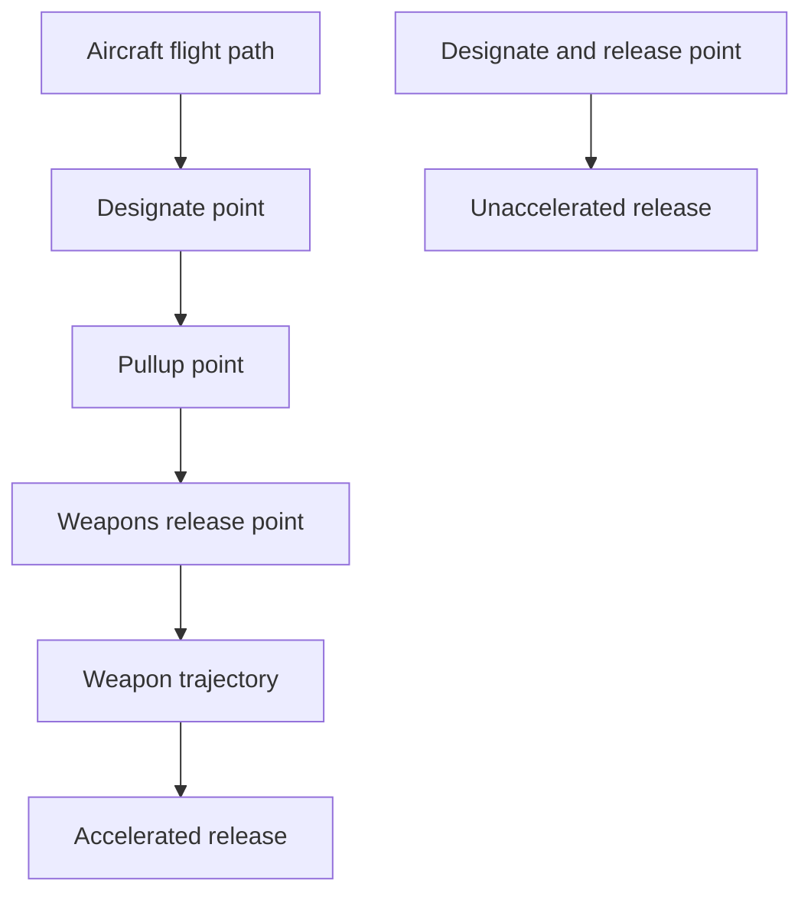

flowchart

Fig. 5.9. Dive delivery profiles.

Level Deliveries. Low-altitude level visual deliveries, as with low-angle dive deliveries, often employ retarded weapons to avoid the fragmentation envelope of the weapons. Since retarded weapons have a shorter ballistic range, optical sightdepression angles are large and in some cases cannot be displayed on the combining glass. This restriction also affects presentation of computer-aided systems. Therefore, low radar-grazing angles and high angular velocity can reduce system accuracy. There are three classes of altitude deliveries: (1) Low-altitude radar deliveries are often accomplished during the night and/or during periods of restricted visibility. Besides the short target acquisition range and aircraft altitude uncertainties, radar target identification at low grazing angles can present significant problems. (2) Medium-altitude level deliveries offer increased acquisition time at attack airspeeds, but increased ballistic range and time of fall decrease accuracy. Typically, low-drag weapons are delivered, and the defense environment is usually benign. (3) High-altitude level releases suffer from the increased release ranges and weapon time of fall with little, if any, improvement in target acquisition.

Lateral Toss Deliveries. Lateral toss deliveries are made during high-g turning maneuvers at low altitude. The maneuver typically is initiated at altitudes of 100–200 ft AGL, evolving into a slight climb to 700–1000 ft AGL, with weapon release occurring in a shallow dive $( 5 ^ { \circ } - 1 0 ^ { \circ } )$ at 600–700 ft AGL, and ending in a descent to low egress. Because of the rapidity of the delivery, only a few bombs are normally released in a stick (note that long sticks of bombs require seeing the desired point of impact earlier than for a single release).
