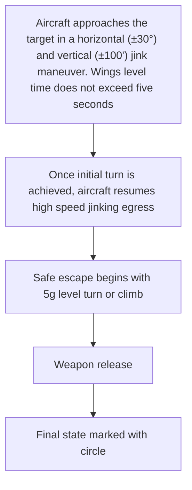

Fig. 5.11. Typical low-altitude/low angle delivery.

Level Radar Delivery Errors. Most of the world’s fighter aircraft today use fully integrated radar delivery systems. Since the radar crosshairs are generated based on slant range, they will move off the target as the range to target decreases. For an aircraft higher than the system altitude, the slant range computed to track the target from the previous position will be too small; thus, the crosshairs will move short of the target. If the weapons officer applies correction to reposition the crosshairs, the resulting increase in computer range will cause the release to be delayed, and the weapon will hit long, due to induced slant-range error. For an error in true airspeed with fully operational digital bombing solution and the correct inertial ground speed, the effect is opposite that of the manual system. Finally, a steering error will cause the weapon to be misdirected during its trajectory by the erroneous steering angle.
