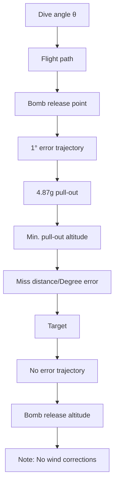

Fig. 5.21. Dive-bomb definitions.

Navigation error at weapon release is only one contributor to the accuracy of unguided bombs. As mentioned in Section 5.1, with the GPS as in input, the contribution of navigation error to impact error becomes small. Finally, we note that in fighter aircraft weapon delivery systems bombing accuracy is highly sensitive to altitude error. In this case, the system designer must consider using a nonstandard day altitude derived from the central air data computer (CADC).

When the bomb is in free fall, and assuming that there is no air resistance, then f = 0. Furthermore, assuming that the impact point and velocity vectors are given by

$$\mathbf {R} ^ {T} = [ X _ {i} Y _ {i} Z _ {i} ],\mathbf {V} ^ {T} = [ V _ {x i} \quad V _ {y i} \quad V _ {z i} ],$$

then we have from the vacuum trajectory the impact points $( X _ { i } , \ Y _ { i } , \ Z _ { i } )$ as follows [1]:

$$X _ {i} = X _ {r} + V _ {x r} t _ {f} + \omega_ {x c}, \tag {5.23a}Y _ {i} = Y _ {r} + V _ {y r} t _ {f} + \omega_ {y c}, \tag {5.23b}Z _ {i} = Z _ {r} + V _ {z r} t _ {f} + \int_ {0} ^ {t _ {f}} \int_ {0} ^ {t} (f _ {z} - g) d \tau d t + \omega_ {z c}, \tag {5.23c}$$

text_image

Vertical
speed
Horizontal
airspeed
Release altitude
above target ha
Ballistic range Rb
Trail
Vh · tf
D
Dv
Dh
mg
V
Vacuum
trajectory

Fig. 5.22. External forces acting on the bomb.

where $\omega _ { x c } , \omega _ { y c } , \omega _ { z c }$ are the components of the Coriolis correction vector $\omega _ { c } ,$ ,

$$\omega_ {c} = - \int_ {0} ^ {t _ {f}} \int_ {0} ^ {t} (2 \Omega \times \mathbf {V}) d \tau d t. \tag {5.24}$$

The apparent Coriolis acceleration is given by the expression

$$\mathbf {A} _ {c} = - 2 \boldsymbol {\Omega} \times \mathbf {V}, \tag {5.25}$$

where  is the Earth rate and V is the bomb velocity vector with respect to the Earth. After performing the vector cross-product operation, the Coriolis equation in component form becomes
