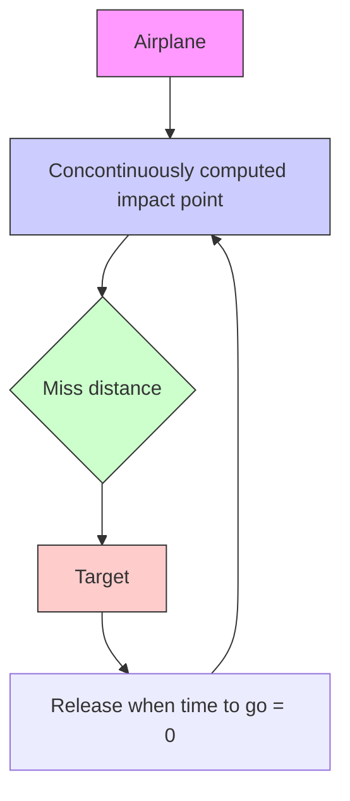
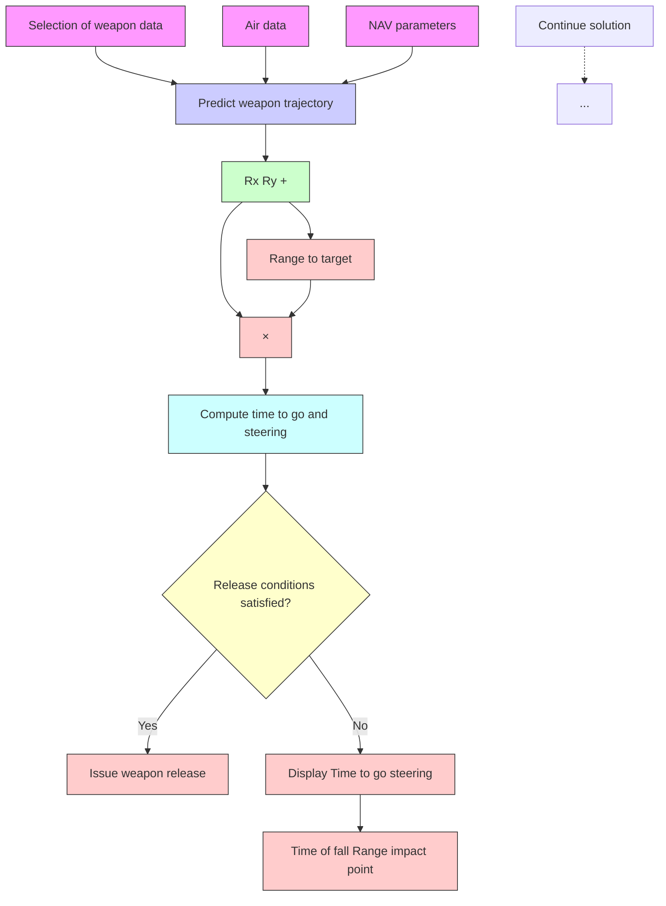

```mermaid
graph TD
    A["Airplane"] --> B["Concontinuously computed impact point"]
    B --> C{Miss distance}
    C --> D["Target"]
    D --> E["Release when time to go = 0"]
    E --> B
    style A fill:#f9f,stroke:#333
    style B fill:#ccf,stroke:#333
    style C fill:#cfc,stroke:#333
    style D fill:#fcc,stroke:#333
```

flowchart

```mermaid
graph TD
    A["Selection of weapon data"] --> B["Predict weapon trajectory"]
    C["Air data"] --> B
    D["NAV parameters"] --> B
    B --> E["Rx Ry +"]
    E --> F["×"]
    F --> G["Compute time to go and steering"]
    G --> H{Release conditions satisfied?}
    H -->|Yes| I["Issue weapon release"]
    H -->|No| J["Display Time to go steering"]
    J --> K["Time of fall Range impact point"]
    E --> L["Range to target"]
    L --> F
    style A fill:#f9f,stroke:#333
    style C fill:#f9f,stroke:#333
    style D fill:#f9f,stroke:#333
    style B fill:#ccf,stroke:#333
    style E fill:#cfc,stroke:#333
    style F fill:#fcc,stroke:#333
    style G fill:#cff,stroke:#333
    style H fill:#ffc,stroke:#333
    style I fill:#fcc,stroke:#333
    style J fill:#fcc,stroke:#333
    style K fill:#fcc,stroke:#333
    style L fill:#fcc,stroke:#333
    style_M["Continue solution"] -.-> N["..."]
```

Fig. 5.26. Overview of weapon delivery solution.
