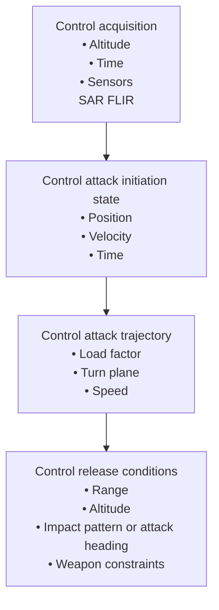

Bomb Range Extrapolation and Weapon Release. The current bomb range is computed in platform coordinates by transformation and extrapolation of the bomb range components obtained from the trajectory integration. The bomb range extrapolation also computes velocity components of the impact point relative to the ground. The bomb range extrapolation requires calculating the partial derivatives of the along-track and cross-track ranges with respect to the release velocities and release altitude. In the CCIP mode, when the depression angle to the CCIP exceeds the lower elevation limit of the HUD aiming reticle, the reticle is positioned near its lower limit and an appropriate time delay is computed to delay the issuing of the weapon release command. Calculations are made to determine the along-track and the cross-track components of miss distance in the target designate modes. These components are computed by differencing range-to-target (obtained from the fixtaking component) and bomb range. The cross-track component of miss distance is used to calculate a lateral steering signal. Also, the along-track component of miss distance is used to compute the time-to-go to weapon release. These computations are also made in the CCIP mode after target designation for a delayed release. In addition, horizontal bomb range and weapon time-of-fall are computed. Finally, these data are provided for display on the fire control/navigation panel. In all modes, a pull-up anticipation and breakaway computation is made.

flowchart

Fig. 5.28. The weapon delivery concept.
