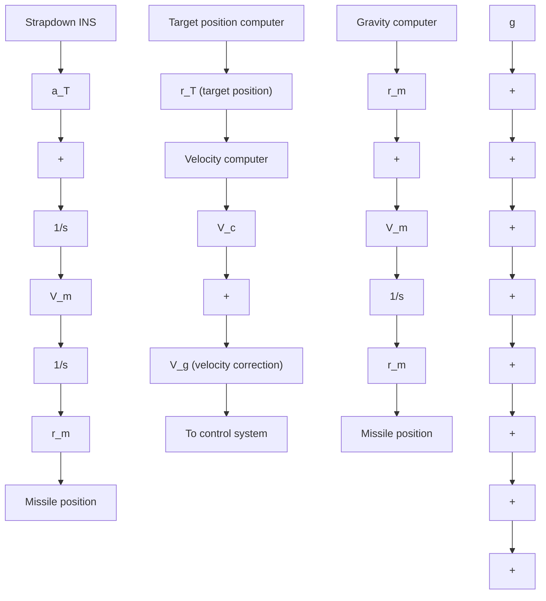

It should be noted here that $\mathbf { a } _ { T }$ , also known as the specific force, accounts for aerodynamic and control forces as well. This is the quantity whose components are measured by physical accelerometers [9], [11],

$$\frac {d \mathbf {V} _ {m}}{d t} = \mathbf {a} _ {T} + \mathbf {g}, \tag {6.179}$$

where g is the gravitational acceleration vector. Figure 6.23 shows a possible indication system for (6.170) and (6.179).

The coordinate system of the missile is chosen as follows: The x-axis points downrange toward the target, the z-axis vertically, and the y-axis out of the paper, completing an orthogonal system. These axes are illustrated in Figure 6.24.

The vector for $d \mathbf { V } _ { g } / d t$ can now be expanded into three scalar equations corresponding to the three accelerometer-input axes as follows:

$$\frac {d V _ {g x}}{d t} = - a _ {T x} - Q _ {x x} V _ {g x} - Q _ {x y} V _ {g y} - Q _ {x z} V _ {g z}, \tag {6.180a}\frac {d V _ {g y}}{d t} = - a _ {T y} - Q _ {y x} V _ {g x} - Q _ {y y} V _ {g y} - Q _ {y z} V _ {g z}, \tag {6.180b}\frac {d V _ {g z}}{d t} = - a _ {T z} - Q _ {z x} V _ {g x} - Q _ {z y} V _ {g y} - Q _ {z z} V _ {g z}. \tag {6.180c}$$

flowchart

Fig. 6.23. A possible indication system.

text_image

Trajectory reference plane
x Down range
y
z

Fig. 6.24. Coordinate system.

It is possible to simplify the Q terms by making the following: assumptions

$$Q _ {x x} = \text { constant (a function of range) },Q _ {y y} = 0 (\text { since the } y \text {-axis is out of the trajectory plane }),Q _ {z x} = \text { constant (a function of range) },Q _ {z z} = Q _ {x x},Q _ {x z} = Q _ {z x},Q _ {y x} = Q _ {x y} = Q _ {y z} = Q _ {z y} = 0.$$
