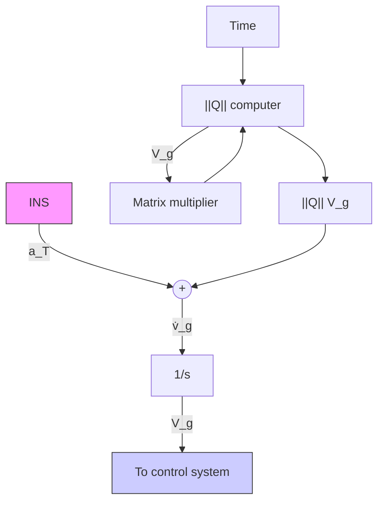

flowchart

Fig. 6.25. Proposed concept for the integration of $d ( \Delta \mathbf { V } _ { g } ) / d t$ .

The cross product control relation is thus stated by the vector expression

$$\omega_ {c} = S \left[ - \left(\frac {d \mathbf {V} _ {g}}{d t}\right) \times \mathbf {V} _ {g} \right] = S \left[ \mathbf {V} _ {g} \times \left(\frac {d \mathbf {V} _ {g}}{d t}\right) \right], \tag {6.194}$$
