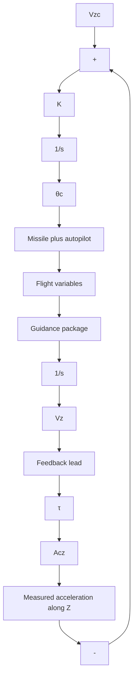

The constants $K _ { 1 }$ and $K _ { 2 }$ in (6.198) and (6.199) are positive numbers, and the signs preceding them are chosen on the basis of the following stability considerations. It should be noted here that if acceleration occurs along the positive Z-body axis due to a disturbance force at the center of pressure, a negative-pitch angular acceleration will result. To counteract this undesirable effect, a positive pitch rate must be commanded, hence the choice of the positive sign preceding $K _ { 2 }$ in (6.198).

In pitch, the problem is more difficult. To try to null the Z-velocity immediately would cause the missile to pitch over upon leaving the launch pad to an angle where there was no output from the Z-accelerometer. Of course, a Z-velocity programmer could also be used. However, a new approach to the problem of controlling Z-velocity appears to have great advantage over a Z-velocity programmer. This method of control, called “Z-velocity steering,” uses the empirical observation that the characteristic time history of Z-velocity during a desirable ascent trajectory can be very closely approximated by an exponential function of time. Because of this, it was found that excellent ascent trajectories could be generated by commanding Z-velocity from its zero value at launch to some final (negative) value. By controlling the time constant of the closed loop that drives Z-velocity to its final value, the desired exponential time history in velocity corresponding to a desirable ascent through the atmosphere can be generated. The equation that accomplishes this characteristic is very simple. An error signal, that is, a pitch command $\theta _ { c }$ that is to be integrated and fed to a missile autopilot that controls missile pitch attitude, can be constructed as follows [14]:

$$\frac {d \theta_ {c}}{d t} = K (V _ {Z c} - [ \tau A _ {T Z} + V _ {Z} ]), \tag {6.200}$$

flowchart

Fig. 6.26. Z-velocity steering block diagram.
