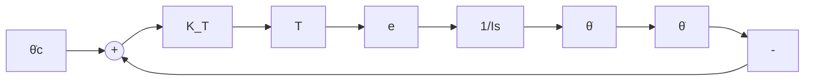

flowchart

Fig. 6.28. Autopilot loop.

where $K _ { T }$ is the autopilot constant, $d \theta _ { c } / d t$ is the commanded pitch rate, and $d \theta / d t$ is the pitch rate. If system stability requirements are satisfied by adjustment of other system parameters, it is possible to select the gain $K _ { T }$ of the autopilot loop from bandwidth considerations alone. The autopilot should have a small response time so that the system can recover quickly from perturbations and then respond to commands. This requirement can be met by making the bandwidth of the loop as large as possible.

Structural considerations require that the missile control system not excite any of the vehicle bending modes. If the bandwidth of the autopilot (i.e., the widest bandwidth loop) is sufficiently below the first bending frequency of the structure, the control system acts like a low-pass filter, and thus attenuates oscillations that would damage the vehicle. An alternative approach is to include a notch filter in the control loop in order to filter out the harmful frequencies. As a result, it is then possible to obtain a wider autopilot bandwidth. This preliminary design will proceed under the assumption that suitable system performance will be obtainable with the narrower bandwidth autopilot. Figure 6.28 illustrates this autopilot loop.

With reference to Figure 6.28, one may write the following approximate expression for the autopilot bandwidth, $B W _ { A P }$ :

$$B W _ {A P} = K _ {T} e T / I, \tag {6.203a}$$

where I is the moment of inertia and e is a stability loop parameter. Using (6.202), we can write the following equation:

$$I s \left(\frac {d \theta}{d t}\right) = K _ {T} T e \left[ \left(\frac {d \theta_ {c}}{d t}\right) - \left(\frac {d \theta}{d t}\right) \right] = K _ {T} T e \left(\frac {d \theta_ {c}}{d t}\right) - K _ {T} T e \left(\frac {d \theta}{d t}\right). \tag {6.203b}$$

Therefore,

$$\left(\frac {d \theta}{d t}\right) / \left(\frac {d \theta_ {c}}{d t}\right) = K _ {T} T e / (I s + K _ {T} T e) = 1 / [ 1 + (I / K _ {T} T e) s ], \tag {6.203c}$$

or, making use of (6.203a), we obtain

$$\left(\frac {d \theta}{d t}\right) / \left(\frac {d \theta_ {c}}{d t}\right) = 1 / [ 1 + (s / B W) ]. \tag {6.203d}$$

An approximate value for $K _ { T }$ lies in the range between 0.3 and 0.5 seconds.
