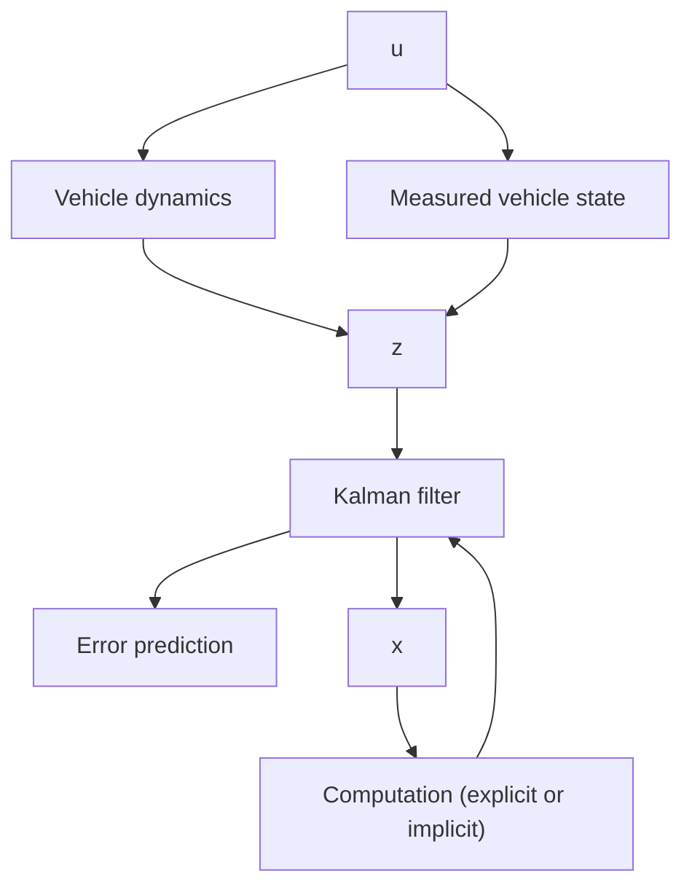

(a) Measurement and generation of the best estimate of the vehicle’s state ${ \bf x } ( t )$ at each control point.   
(b) Compare actual state $\mathbf { r } ( t )$ to the nominal state $\mathbf { r } ^ { * } ( t )$ to produce positional error state, $\delta \mathbf { r } ( t )$ . That is, $\delta \mathbf { r } ( t ) = \mathbf { r } ( t ) - \mathbf { r } ^ { * } ( t )$ .   
(c) Computation of the desired velocity vector variation $\delta { \bf V } ( t )$ to compensate for a deviation from the nominal state.   
(d) Update the nominal velocity vector $\mathbf { V } ^ { * } ( t )$ to produce a desired velocity vector ${ \bf V } _ { c } ( t ) , { \bf V } _ { c } ( t ) = { \bf V } ^ { * } ( t ) + \delta { \bf V } ( t )$ .   
(e) Compute cut-off signal and steering command from $\mathbf { V } _ { g } ( t )$

This algorithm is not as flexible as the explicit guidance law; it is restricted in the number of terminal points by the capacity of the airborne computer memory.

flowchart

Fig. 6.30. Explicit and implicit guidance laws.

The computer program of this algorithm is also less complex, since much of the computation is accomplished before launch.

Figure 6.30 presents a simple block diagram of the explicit and implicit guidance laws.
