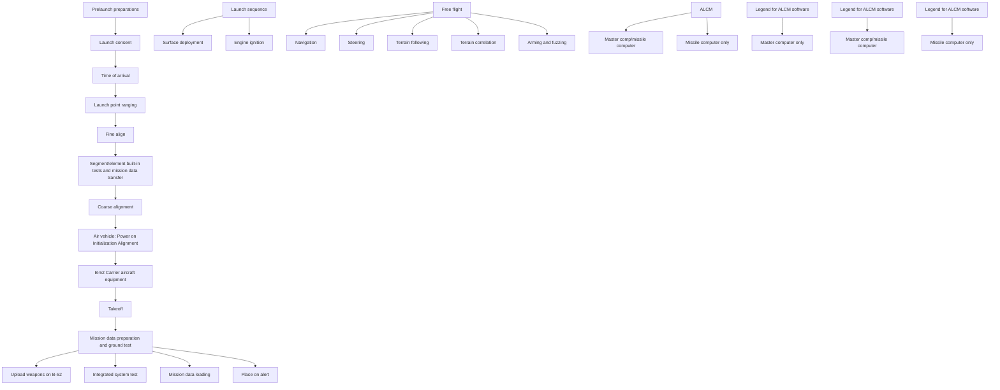

Figure 7.1 illustrates the primary mission functions, their time sequencing, and the role the missile and carrier aircraft computers play in each part of the mission. After ground testing of the aircraft and missile systems, the B-52 with missiles uploaded is placed on alert. Next, the mission planner selects a path for the ALCM, which is part of the mission data preparation system (MDPS), from launch to target that passes over the terrain maps. The planner has flexibility between maps, but must fly over the maps in the direction of map orientation. The distances between maps must be chosen so that there is a high probability of crossing the maps yet not so close as to unnecessarily constrain the missile flight path. The probability of map overflight is computed for each map of the mission by computing the ratio of the crosstrack and downtrack errors to one-half the map function. This function calculates the probability of overflight with negligible error. Also, the mission planner selects the vertical profile based on knowledge of the terrain on the missile flight path and other trajectory requirements.

flowchart

Fig. 7.1. Typical mission functions.
