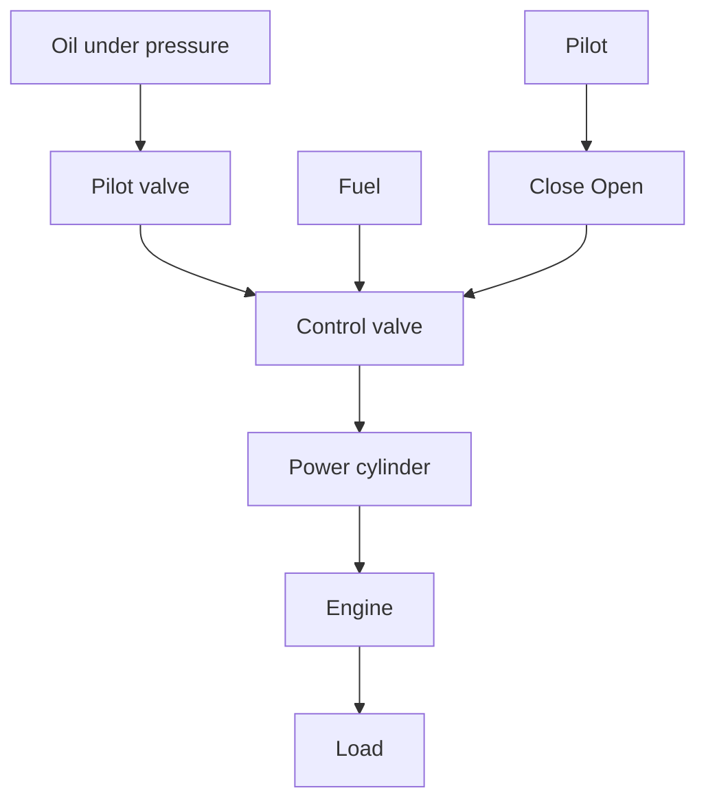

The sequence of actions may be stated as follows: The speed governor is adjusted such that, at the desired speed, no pressured oil will flow into either side of the power cylinder. If the actual speed drops below the desired value due to disturbance, then the decrease in the centrifugal force of the speed governor causes the control valve to move downward, supplying more fuel, and the speed of the engine increases until the desired value is reached. On the other hand, if the speed of the engine increases above the desired value, then the increase in the centrifugal force of the governor causes the control valve to move upward. This decreases the supply of fuel, and the speed of the engine decreases until the desired value is reached.

In this speed control system, the plant (controlled system) is the engine and the controlled variable is the speed of the engine. The difference between the desired speed and the actual speed is the error signal. The control signal (the amount of fuel) to be applied to the plant (engine) is the actuating signal. The external input to disturb the controlled variable is the disturbance. An unexpected change in the load is a disturbance.

Temperature Control System. Figure 1–2 shows a schematic diagram of temperature control of an electric furnace. The temperature in the electric furnace is measured by a thermometer, which is an analog device.The analog temperature is converted to a digital temperature by an A/D converter. The digital temperature is fed to a controller through an interface.This digital temperature is compared with the programmed input temperature, and if there is any discrepancy (error), the controller sends out a signal to the heater, through an interface, amplifier, and relay, to bring the furnace temperature to a desired value.

flowchart

Figure 1–1 Speed control system.   
Chapter 1 / Introduction to Control Systems

Figure 1–2 Temperature control system.   

flowchart

