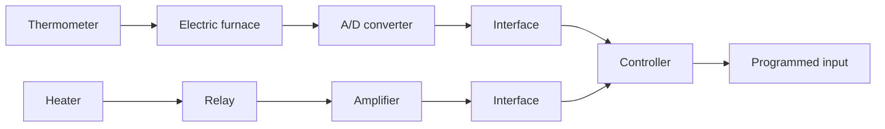

Business Systems. A business system may consist of many groups. Each task assigned to a group will represent a dynamic element of the system. Feedback methods of reporting the accomplishments of each group must be established in such a system for proper operation. The cross-coupling between functional groups must be made a minimum in order to reduce undesirable delay times in the system. The smaller this crosscoupling, the smoother the flow of work signals and materials will be.

A business system is a closed-loop system. A good design will reduce the managerial control required. Note that disturbances in this system are the lack of personnel or materials, interruption of communication, human errors, and the like.

The establishment of a well-founded estimating system based on statistics is mandatory to proper management. It is a well-known fact that the performance of such a system can be improved by the use of lead time, or anticipation.

To apply control theory to improve the performance of such a system, we must represent the dynamic characteristic of the component groups of the system by a relatively simple set of equations.

Although it is certainly a difficult problem to derive mathematical representations of the component groups, the application of optimization techniques to business systems significantly improves the performance of the business system.

Consider, as an example, an engineering organizational system that is composed of major groups such as management, research and development, preliminary design, experiments, product design and drafting, fabrication and assembling, and tesing. These groups are interconnected to make up the whole operation.

Such a system may be analyzed by reducing it to the most elementary set of components necessary that can provide the analytical detail required and by representing the dynamic characteristics of each component by a set of simple equations. (The dynamic performance of such a system may be determined from the relation between progressive accomplishment and time.)

