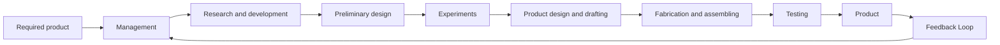

flowchart

Figure 1–3 Block diagram of an engineering organizational system.

A functional block diagram may be drawn by using blocks to represent the functional activities and interconnecting signal lines to represent the information or product output of the system operation. Figure 1–3 is a possible block diagram for this system.

Robust Control System. The first step in the design of a control system is to obtain a mathematical model of the plant or control object. In reality, any model of a plant we want to control will include an error in the modeling process. That is, the actual plant differs from the model to be used in the design of the control system.

To ensure the controller designed based on a model will work satisfactorily when this controller is used with the actual plant, one reasonable approach is to assume from the start that there is an uncertainty or error between the actual plant and its mathematical model and include such uncertainty or error in the design process of the control system. The control system designed based on this approach is called a robust control system.

Suppose that the actual plant we want to control is $\widetilde G ( s )$ and the mathematical model of the actual plant is $G ( s )$ , that is,

$$\widetilde {G} (s) = \text { actual plant model that has uncertainty } \Delta (s)G (s) = \text { nominal plant model to be used for designing the control system }$$

$\widetilde G ( s )$ and $G ( s )$ may be related by a multiplicative factor such as

$$\widetilde {G} (s) = G (s) [ 1 + \Delta (s) ]$$

or an additive factor

$$\widetilde {G} (s) = G (s) + \Delta (s)$$

or in other forms.

Since the exact description of the uncertainty or error $\Delta ( s )$ is unknown, we use an estimate of $\Delta ( s )$ and use this estimate, $W ( s )$ , in the design of the controller. $W ( s )$ is a scalar transfer function such that

$$\| \Delta (s) \| _ {\infty} < \| W (s) \| _ {\infty} = \max _ {0 \leq \omega \leq \infty} | W (j \omega) |$$

where $\| W ( s ) \| _ { \infty }$ is the maximum value of $| W ( j \omega ) |$ for- $0 \leq \omega \leq \infty$ and is called the H infinity norm of $W ( s )$ .
