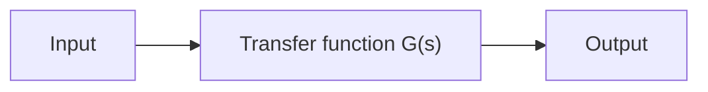

# 2–3 AUTOMATIC CONTROL SYSTEMS

A control system may consist of a number of components. To show the functions performed by each component, in control engineering, we commonly use a diagram called the block diagram. This section first explains what a block diagram is. Next, it discusses introductory aspects of automatic control systems, including various control actions.Then, it presents a method for obtaining block diagrams for physical systems, and, finally, discusses techniques to simplify such diagrams.

Block Diagrams. A block diagram of a system is a pictorial representation of the functions performed by each component and of the flow of signals. Such a diagram depicts the interrelationships that exist among the various components. Differing from a purely abstract mathematical representation, a block diagram has the advantage of indicating more realistically the signal flows of the actual system.

In a block diagram all system variables are linked to each other through functional blocks.The functional block or simply block is a symbol for the mathematical operation on the input signal to the block that produces the output. The transfer functions of the components are usually entered in the corresponding blocks, which are connected by arrows to indicate the direction of the flow of signals. Note that the signal can pass only in the direction of the arrows. Thus a block diagram of a control system explicitly shows a unilateral property.

Figure 2–1 shows an element of the block diagram. The arrowhead pointing toward the block indicates the input, and the arrowhead leading away from the block represents the output. Such arrows are referred to as signals.

Figure 2–1 Element of a block diagram.   

flowchart

Note that the dimension of the output signal from the block is the dimension of the input signal multiplied by the dimension of the transfer function in the block.
