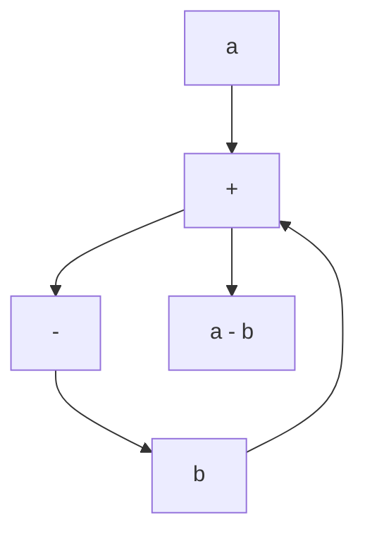

The advantages of the block diagram representation of a system are that it is easy to form the overall block diagram for the entire system by merely connecting the blocks of the components according to the signal flow and that it is possible to evaluate the contribution of each component to the overall performance of the system.

In general, the functional operation of the system can be visualized more readily by examining the block diagram than by examining the physical system itself. A block diagram contains information concerning dynamic behavior, but it does not include any information on the physical construction of the system. Consequently, many dissimilar and unrelated systems can be represented by the same block diagram.

It should be noted that in a block diagram the main source of energy is not explicitly shown and that the block diagram of a given system is not unique.A number of different block diagrams can be drawn for a system, depending on the point of view of the analysis.

flowchart

Figure 2–2 Summing point.

Summing Point. Referring to Figure 2–2, a circle with a cross is the symbol that indicates a summing operation. The plus or minus sign at each arrowhead indicates whether that signal is to be added or subtracted. It is important that the quantities being added or subtracted have the same dimensions and the same units.

Branch Point. A branch point is a point from which the signal from a block goes concurrently to other blocks or summing points.

Block Diagram of a Closed-Loop System. Figure 2–3 shows an example of a block diagram of a closed-loop system. The output C(s) is fed back to the summing point, where it is compared with the reference input R(s). The closed-loop nature of the system is clearly indicated by the figure. The output of the block, C(s) in this case, is obtained by multiplying the transfer function G(s) by the input to the block, E(s).Any linear control system may be represented by a block diagram consisting of blocks, summing points, and branch points.
