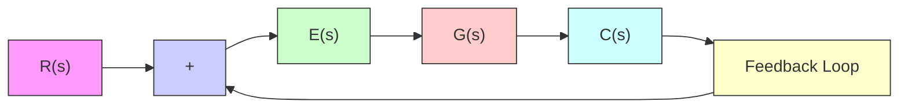
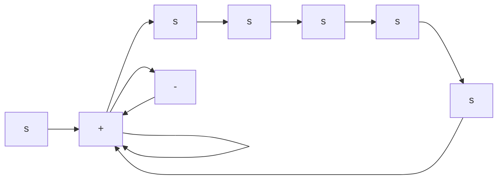

When the output is fed back to the summing point for comparison with the input, it is necessary to convert the form of the output signal to that of the input signal. For example, in a temperature control system, the output signal is usually the controlled temperature. The output signal, which has the dimension of temperature, must be converted to a force or position or voltage before it can be compared with the input signal. This conversion is accomplished by the feedback element whose transfer function is H(s), as shown in Figure 2–4.The role of the feedback element is to modify the output before it is compared with the input. (In most cases the feedback element is a sensor that measures the output of the plant. The output of the sensor is compared with the system input, and the actuating error signal is generated.) In the present example, the feedback signal that is fed back to the summing point for comparison with the input is $B ( s ) = H ( s ) C ( s )$ .

flowchart

Figure 2–3 Block diagram of a closed-loop system.

Figure 2–4 Closed-loop system.   

flowchart

Open-Loop Transfer Function and Feedforward Transfer Function. Referring to Figure 2–4, the ratio of the feedback signal $B ( s )$ to the actuating error signal $E ( s )$ is called the open-loop transfer function. That is,

$$\text { Open - loop transfer function } = \frac {B (s)}{E (s)} = G (s) H (s)$$

The ratio of the output $C ( s )$ to the actuating error signal $E ( s )$ is called the feedforward transfer function, so that

$$\text { Feedforward transfer function } = \frac {C (s)}{E (s)} = G (s)$$

If the feedback transfer function $H ( s )$ is unity, then the open-loop transfer function and the feedforward transfer function are the same.
