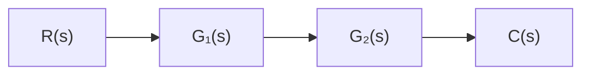
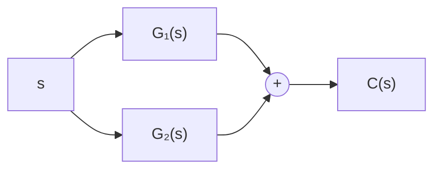
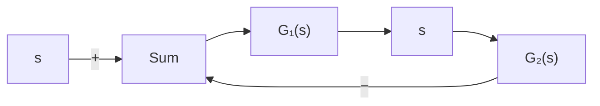

flowchart

flowchart

flowchart

Figure 2–5

(a) Cascaded system;

(b) parallel system;

(c) feedback (closedloop) system.

<table><tr><td>MATLAB Program 2-1</td></tr><tr><td>num1 = [10];den1 = [1 2 10];num2 = [5];den2 = [1 5];[num, den] = series(num1,den1,num2,den2); printsys(num,den)num/den = $\frac{50}{s^{3} + 7s^{2} + 20s + 50}$ [num, den] = parallel(num1,den1,num2,den2); printsys(num,den)num/den = $\frac{5s^{2} + 20s + 100}{s^{3} + 7s^{2} + 20s + 50}$ [num, den] = feedback(num1,den1,num2,den2); printsys(num,den)num/den = $\frac{10s + 50}{s^{3} + 7s^{2} + 20s + 100}$ </td></tr></table>

Automatic Controllers. An automatic controller compares the actual value of the plant output with the reference input (desired value), determines the deviation, and produces a control signal that will reduce the deviation to zero or to a small value. The manner in which the automatic controller produces the control signal is called the control action. Figure 2–6 is a block diagram of an industrial control system, which consists of an automatic controller, an actuator, a plant, and a sensor (measuring element). The controller detects the actuating error signal, which is usually at a very low power level, and amplifies it to a sufficiently high level. The output of an automatic controller is fed to an actuator, such as an electric motor, a hydraulic motor, or a pneumatic motor or valve. (The actuator is a power device that produces the input to the plant according to the control signal so that the output signal will approach the reference input signal.)
