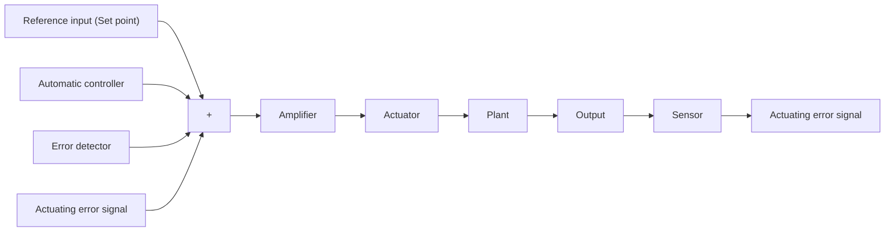

Figure 2–6 Block diagram of an industrial control system, which consists of an automatic controller, an actuator, a plant, and a sensor (measuring element).   

flowchart

The sensor or measuring element is a device that converts the output variable into another suitable variable, such as a displacement, pressure, voltage, etc., that can be used to compare the output to the reference input signal.This element is in the feedback path of the closed-loop system. The set point of the controller must be converted to a reference input with the same units as the feedback signal from the sensor or measuring element.

Classifications of Industrial Controllers. Most industrial controllers may be classified according to their control actions as:

1. Two-position or on–off controllers   
2. Proportional controllers   
3. Integral controllers   
4. Proportional-plus-integral controllers   
5. Proportional-plus-derivative controllers   
6. Proportional-plus-integral-plus-derivative controllers

Most industrial controllers use electricity or pressurized fluid such as oil or air as power sources. Consequently, controllers may also be classified according to the kind of power employed in the operation, such as pneumatic controllers, hydraulic controllers, or electronic controllers. What kind of controller to use must be decided based on the nature of the plant and the operating conditions, including such considerations as safety, cost, availability, reliability, accuracy, weight, and size.

Two-Position or On–Off Control Action. In a two-position control system, the actuating element has only two fixed positions, which are, in many cases, simply on and off. Two-position or on–off control is relatively simple and inexpensive and, for this reason, is very widely used in both industrial and domestic control systems.
