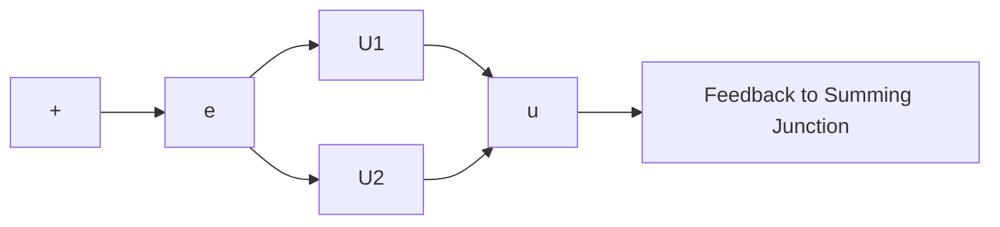

Let the output signal from the controller be $u ( t )$ and the actuating error signal be $e ( t )$ . In two-position control, the signal $u ( t )$ remains at either a maximum or minimum value, depending on whether the actuating error signal is positive or negative, so that

$$
\begin{array}{l} u (t) = U _ {1}, \quad \text {   for   } e (t) > 0 \\ = U _ {2}, \quad \text {   for   } e (t) <   0 \\ \end{array}
$$

where $U _ { 1 }$ and $U _ { 2 }$ are constants. The minimum value $U _ { 2 }$ is usually either zero $\mathrm { o r } - U _ { 1 }$ . Two-position controllers are generally electrical devices, and an electric solenoid-operated valve is widely used in such controllers. Pneumatic proportional controllers with very high gains act as two-position controllers and are sometimes called pneumatic twoposition controllers.

Figures 2–7(a) and (b) show the block diagrams for two-position or on–off controllers. The range through which the actuating error signal must move before the switching occurs is called the differential gap. A differential gap is indicated in Figure 2–7(b). Such a differential gap causes the controller output u(t) to maintain its present value until the actuating error signal has moved slightly beyond the zero value. In some cases, the differential gap is a result of unintentional friction and lost motion; however, quite often it is intentionally provided in order to prevent too-frequent operation of the on–off mechanism.

Figure 2–7 (a) Block diagram of an on–off controller; (b) block diagram of an on–off controller with differential gap.   

flowchart

(a)

text_image

Differential gap
e
U₁
U₂
u

(b)
