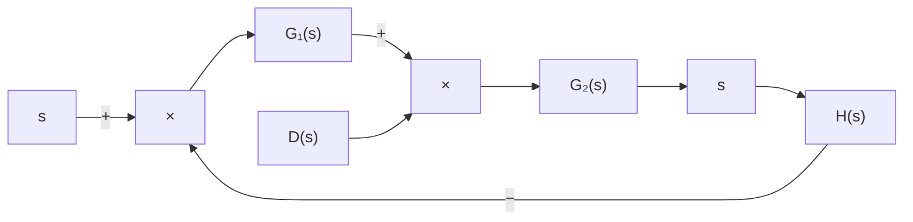

Closed-Loop System Subjected to a Disturbance. Figure 2–11 shows a closedloop system subjected to a disturbance. When two inputs (the reference input and disturbance) are present in a linear time-invariant system, each input can be treated independently of the other; and the outputs corresponding to each input alone can be added to give the complete output. The way each input is introduced into the system is shown at the summing point by either a plus or minus sign.

Consider the system shown in Figure 2–11. In examining the effect of the disturbance $D ( s )$ , we may assume that the reference input is zero; we may then calculate the response $C _ { D } ( s )$ to the disturbance only. This response can be found from

$$\frac {C _ {D} (s)}{D (s)} = \frac {G _ {2} (s)}{1 + G _ {1} (s) G _ {2} (s) H (s)}$$

On the other hand, in considering the response to the reference input $R ( s )$ , we may assume that the disturbance is zero.Then the response $C _ { R } ( s )$ to the reference input $R ( s )$ can be obtained from

$$\frac {C _ {R} (s)}{R (s)} = \frac {G _ {1} (s) G _ {2} (s)}{1 + G _ {1} (s) G _ {2} (s) H (s)}$$

The response to the simultaneous application of the reference input and disturbance can be obtained by adding the two individual responses. In other words, the response $C ( s )$ due to the simultaneous application of the reference input $R ( s )$ and disturbance $D ( s )$ is given by

$$
\begin{array}{l} C (s) = C _ {R} (s) + C _ {D} (s) \\ = \frac {G _ {2} (s)}{1 + G _ {1} (s) G _ {2} (s) H (s)} \left[ G _ {1} (s) R (s) + D (s) \right] \\ \end{array}
$$

Consider now the case where $| G _ { 1 } ( s ) H ( s ) | \gg 1$ and $| G _ { 1 } ( s ) G _ { 2 } ( s ) H ( s ) | \gg 1$ . In this case, the closed-loop transfer function $C _ { D } ( s ) / D ( s )$ becomes almost zero, and the effect of the disturbance is suppressed. This is an advantage of the closed-loop system.
