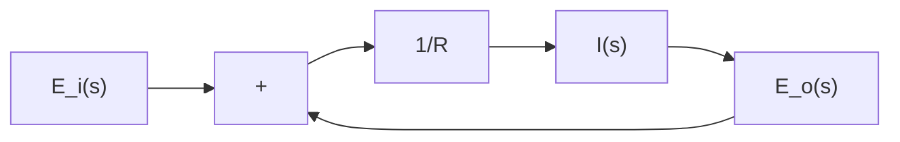
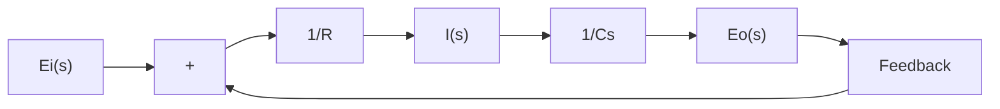

chemical

Electrical circuit diagram with resistor, capacitor, and current direction labels

(a)

flowchart

(b)

flowchart

(d)

A complicated block diagram involving many feedback loops can be simplified by a step-by-step rearrangement. Simplification of the block diagram by rearrangements considerably reduces the labor needed for subsequent mathematical analysis. It should be noted, however, that as the block diagram is simplified, the transfer functions in new blocks become more complex because new poles and new zeros are generated.
